# Restless

https://github.com/user-attachments/assets/9e8fa0e4-c8ad-43a1-af92-c7ef9d3602a6

**Product walkthrough** — 38 seconds inside an illustrative studio business: shared documents, feedback, a playable prototype, the company computer and authority controls. Real development UI, with narration and [captions](docs/media/restless-product-tour.vtt). [Download MP4](https://github.com/BlueprintLabIO/restless-core/raw/refs/heads/dev/docs/media/restless-product-tour.mp4).

**Run your business with AI. Spend your attention on the work that needs you.**

Restless is an open-source, multiplayer AI workspace for founders and teams. Humans
and AI agents work together through shared documents, conversations, ongoing work,
and a persistent company computer.
You set direction, collaborate on the output, and make the decisions that need your
judgement. Agents carry the work forward.

**Bring your people. Bring Codex, Claude, or your preferred API provider.**

The goal is simple: **more useful business output for less of your attention.**

[Why Restless](#why-restless) · [Features](#features) · [Product tour](#product-tour) ·
[Getting started](#getting-started) ·
[Alternatives](#alternatives) · [Architecture](#architecture) · [Contributing](#contributing)

> **Development preview.** Restless Core is an active rebuild with a runnable local
> company appliance, not yet a production release. Native document collaboration is
> implemented, but agent editing, review integration, and deployment verification are
> still being completed. Expect a developer setup and changing interfaces.

## Why Restless

AI can do a growing share of business work. Coordinating it can become a job of its own:
repeating context, moving drafts between tools, checking whether something is actually
finished, and working out which interruption needs a decision.

Restless starts with the owner's experience. The main surface holds the work; an
executive conversation stays alongside it. The system should bring you a useful result,
a prepared decision, or the exact place where your participation is needed.

### Your attention is part of the budget

A decision should arrive with context: what happened, why it matters, a recommendation,
and what happens if you do nothing. Work assigned to a lead should stay with that lead
until it genuinely needs the owner. Internal activity is not automatically a reason to
interrupt you.

### Human multiplayer is a first-class feature

Run the company together. Cofounders, designers, operators and reviewers can participate
as distinct humans alongside AI agents, with their own access to shared work and
conversations. Collaborate in documents, discuss changes in rooms, and keep decisions
and feedback attached to the result.

Multiplayer here means multiple people working with AI in a shared company—not simply
several agents talking to one another. Human membership, scoped conversations and
collaborative document primitives are implemented; the remaining integration work is
called out in the development-preview note.

### Collaboration belongs beside the output

Business work involves revising a proposal, questioning a source, changing a plan, or
working through a decision together. Restless puts documents, conversation, review and
execution in the same workspace. Documents have versions and anchored comments;
revision feedback stays connected to the work.

### Orchestration has to earn its cost

Restless uses persistent roles and accountable leads internally. The default production
shape is one capable worker for a coherent outcome, with additional workers when
specialisation, independent evidence or parallel work justify the coordination.

We test that assumption. In a [small internal experiment](experiment/coordination/experiments/EXP-17/RESULTS.md),
extra supervision produced similar assessed quality across four paired tasks while
adding substantial time and cost. That informs the design; it is not a benchmark
against other products or a claim that collaboration never helps.

### Completion means something you can review

The review surface should be the current document, live page, file or other usable
result. Restless tracks review targets, checks availability, rejects stale review
state, and carries requested changes into the next revision. When you need to step in,
the handoff records the exact action, prepared state and condition for resuming.

## Features

These are components in the current codebase. The development-preview status above
applies to the complete experience.

| Surface | What it is for |
| --- | --- |
| **Human multiplayer** | Multiple human collaborators alongside AI agents, with scoped access, shared conversations and collaborative documents. |
| **Model choice** | Native Codex and Claude connections, API-key providers, and configurable OpenAI-compatible gateways. |
| **Executive chat** | Set direction, discuss the business, and steer work from a conversation alongside the main surface. |
| **Attention** | Review prepared decisions, approvals and human handoffs with context and recommended action. |
| **Work** | Follow outcomes, inspect the current result, and request revisions with durable feedback. |
| **Documents** | Edit native documents with a collaborative editor, versions, anchored comments and access controls. End-to-end agent collaboration remains in progress. |
| **People and conversations** | Keep accountable roles and durable discussion context around ongoing work. |
| **Browser and computer** | Work in a persistent Linux environment with files, applications and a browser; use the owner surface to take control when needed. |
| **Authority & permissions** | Visible autonomy boundaries, owner decisions, outcome standards and model spend ceilings. |
| **Vault** | Company credential inventory with values hidden and separate credential custody. |
| **Resources and Doctor** | Timestamped resource observations and diagnostics for the company execution environment. |
| **External actions** | Inspect governed effects separately from ordinary internal work. |
| **CLI** | Operate the local company appliance and inspect its state from the terminal. Command coverage is evolving. |

The intended scope includes research, sales preparation, planning, operations and
software development. A useful first evaluation is a bounded business brief: research a
customer segment, draft an offer with sources, revise it with the owner, and prepare
the next action. Judge the result and the supervision required, not the number of
agents involved.

## Getting started

The current entry point is a **local development checkout**. You need Rust/Cargo,
Node.js/npm, Docker with a running daemon, curl, and credentials for the configured
model provider. The development script builds the daemon and company image, so the
first run is substantial.

```sh
git clone https://github.com/BlueprintLabIO/restless-core.git
cd restless-core
npm --prefix web install
./scripts/restless-dev --help
```

### Bring Codex, Claude, or your own API key

**Z.ai is not required. Restless is not tied to one model vendor.**

| Connection | How it works |
| --- | --- |
| **Codex** | Native Codex harness with its own sign-in or an OpenAI API key. |
| **Claude** | Native Claude agent harness with its own sign-in or an Anthropic API key. |
| **Other API providers** | Provider connections include Google Gemini, OpenRouter, Groq, Mistral, DeepSeek, xAI, Moonshot and Z.ai. |
| **Custom endpoints** | Configure a compatible provider or OpenAI-compatible gateway with its model IDs, endpoint and credentials. |

Choose connections in the company's intelligence settings. Account access, model
availability and tool support still depend on the chosen provider and harness; an
arbitrary API key is not a guarantee of protocol compatibility.

For an API-backed development company, explicitly select your provider instead of
relying on the launcher's legacy fallback. For example, with an Anthropic API key
already available in your shell:

```sh
export RESTLESS_DEV_MODEL=anthropic/claude-sonnet-4-6
export RESTLESS_DEV_CREDENTIAL_REFERENCE=env:ANTHROPIC_API_KEY
./scripts/restless-dev demo_test --reconcile

# In another terminal, from the same checkout:
./scripts/restless-dev doctor demo_test
```

Use the provider/model ID and credential reference for your own connection. These
variables initialise a new development company; they do not replace the native
Codex/Claude sign-in flow or reconfigure an existing company. The current launcher
still has a Z.ai fallback when neither variable is set; this README deliberately
uses an explicit provider selection. Removing that fallback from the launcher is a
separate implementation change.

Open the address printed by the launcher; ports are specific to the checkout. Ctrl-C
stops its foreground host processes. Company containers and volumes persist. A rendered
page alone is not a connected appliance: use the doctor check to inspect the local path.

See [web development](web/README.md) and [build storage guidance](docs/BUILD_STORAGE.md)
for more detail. This is a development path, not a verified one-command production install.

## Example: a small game studio, humans and AI together

**Lantern Studio** is an illustrative company making a two-player co-op puzzle game.
The founder's brief: “Make a ten-minute prototype where players must coordinate to
relight a lighthouse. We should be able to play it together and decide whether the
core mechanic is fun.”

| Teammate | Responsibility | Collaboration in Restless |
| --- | --- | --- |
| Human creative director | Sets the feel, scope and acceptance criteria | Co-edits the design brief, discusses trade-offs, and approves the playable result. |
| Human artist / playtester | Supplies visual direction and evaluates the experience | Adds references and comments, plays with the founder, and records confusing moments. |
| AI production lead | Owns the prototype outcome and resolves blockers | Keeps the brief, implementation and review aligned; brings meaningful decisions to the humans. |
| AI game developer | Builds and revises the playable prototype | Works in the company computer and presents the actual build for review. |
| AI QA specialist, when useful | Provides independent evidence | Checks controls, restart behaviour and two-player progression; returns reproducible findings. |

1. **Agree on the game.** The humans refine a shared brief with the lead: one level,
   one cooperation mechanic, keyboard/controller needs, and a clear end state.
2. **Build the smallest playable version.** The developer implements the game. Add an
   art or QA specialist only when the contribution justifies the extra coordination.
3. **Play together.** Humans open the build and test it together. “Player two cannot
   tell when the switch is active” becomes specific feedback on that version.
4. **Revise the output.** The developer changes the cue, QA checks the regression,
   and the same work keeps its feedback and review history.
5. **Make the business decision.** The lead prepares the choice: another prototype
   iteration, a small external playtest, or a stop. The humans decide whether it is
   worth pursuing before spending more.

The deliverable is a playable game, shared design notes and a test report. Restless
multiplayer is the collaboration between the people and agents; the game's networking
or local co-op mechanics are part of the game itself.

*This is an example workflow, not a claim that this studio or game has completed a
production run. It illustrates the experience to demonstrate with a real pilot.*

## Product tour

The video above uses a staged Lantern Studio scenario in the real Restless development
build. It demonstrates the collaboration surfaces and a playable example, rather than
a completed autonomous company run. [Media notes](docs/media/README.md) describe the capture.

The screenshots below were captured on 21 September 2026 from the existing Site
Renovation company. All images and the video use a consistent **1920 × 1080 (16:9)** frame.
Account emails are masked in provider screenshots; product state is otherwise unchanged.
Empty states are identified below.

### A company computer you can actually enter

Agents work in a persistent company Linux environment with a browser, files and
applications. Open its desktop inside Restless to inspect the same environment. It
opens in viewing mode; **Take control** enables input when your participation is needed,
and **Leave computer** returns you to the workspace.

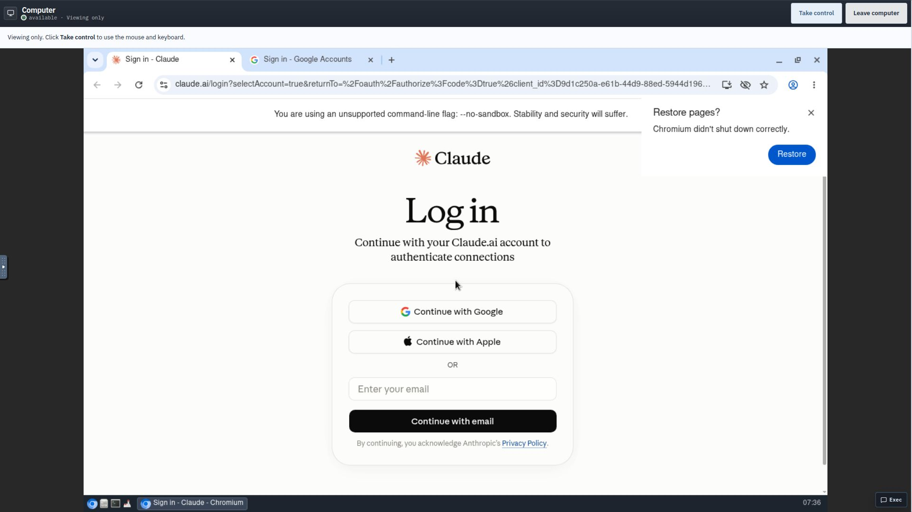

*The live desktop is displaying a provider login page. The capture demonstrates the
embedded computer and viewing controls, not a completed login. The company environment
is container-backed; this is not a claim that every application inside it has its own
sandbox. Chromium's visible launch warning is retained.*

### Explicit authority and permissions

Let agents research, build and prepare work while keeping consequential authority
bounded. **Authority & limits** makes the distinction visible: what the company may
do independently, what it must ask you about, and what it cannot grant itself.
The same screen shows the outcome standard, model spend ceiling and standing grants.

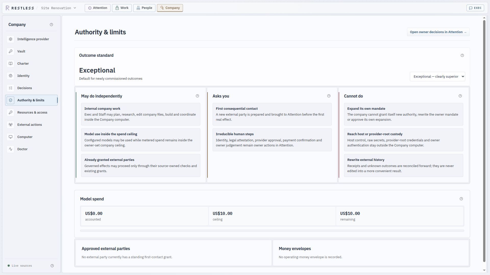

*The selected outcome standard is an ambition for new work, not evidence of superior
output. No authority setting or spend ceiling was changed for this capture.*

### Roles with clear accountability

People connects an agent's role to its actual work and accountable lead. You can see
who is producing, who owns the outcome, and where to take a question. In this example,
Coraline is a reviewer and Alice is accountable for the launch work.

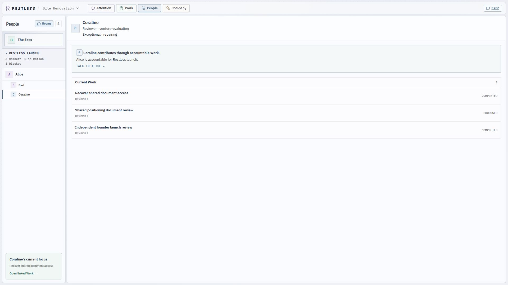

*The work states are real observations from the captured company.*

### Choose intelligence per agent

Use a company default or assign a different connection and model to a particular agent.
The assignment panel makes the choice visible alongside the role. A researcher, lead
and reviewer can have different model requirements without becoming separate companies.

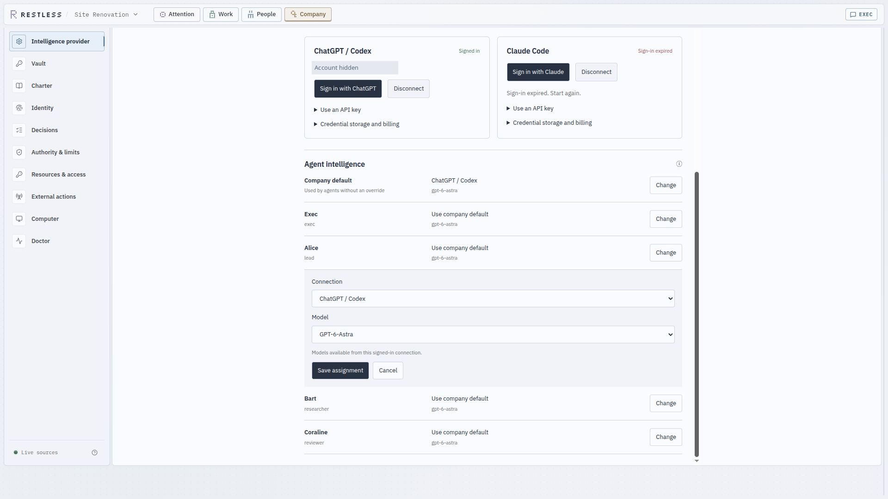

*This is the actual model assignment editor, with the account email masked. It was
opened for inspection and cancelled without saving.*

### Bring your provider

Native Codex and Claude connections sit alongside API-key providers and compatible
gateways. Provider setup is a company concern, while individual agents can inherit or
override the selected intelligence. The capture below shows the API connection form.

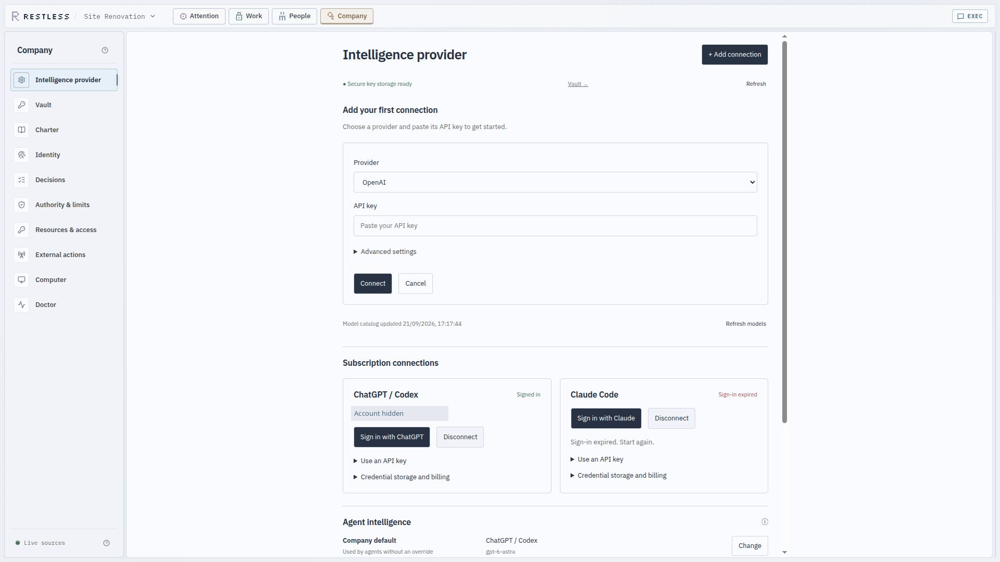

*The key field is empty. No credential was entered or changed.*

### Human and agent room membership

Rooms have explicit participants. A conversation belongs to its audience, making the
human and agent collaboration boundary inspectable rather than assuming every agent
or person can read every discussion.

The inspected direct room contained one human and one agent. That establishes its
membership display, not a multi-human editing benchmark.

### Know which resources are available

**Resources & access** reports what the company can use, with observed state, source
and timestamp. A configured model route is distinguished from a verified response;
a running service is distinguished from an outcome someone can open.

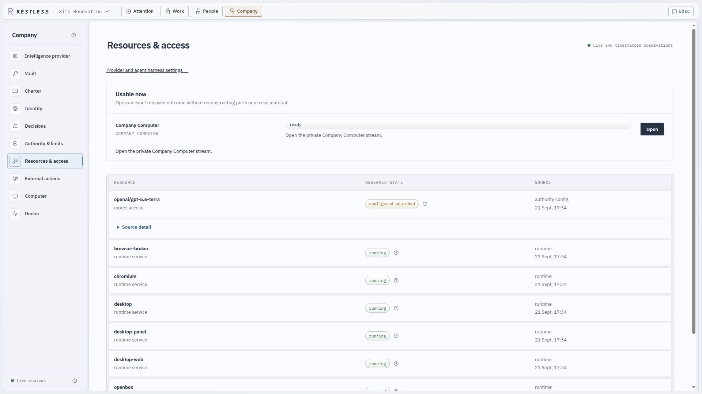

### Keep credential custody separate

The Vault gives the owner a view of company credential storage while keeping secret
values hidden. Intelligence connections can use the appropriate credential path
without putting raw keys into ordinary company conversation.

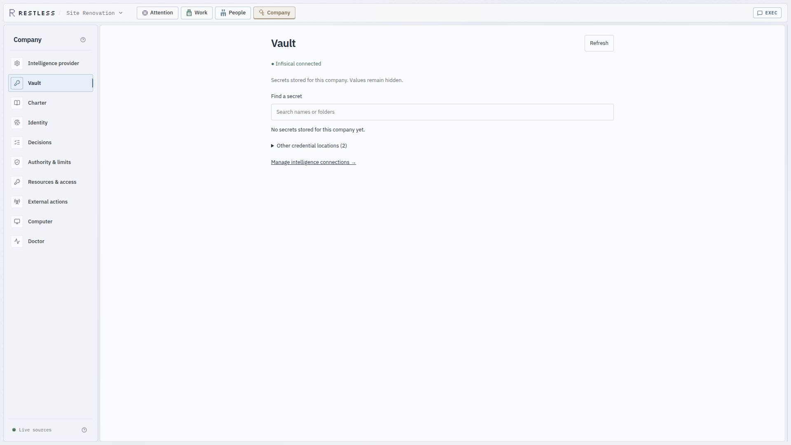

*This company has no entries in the displayed Vault inventory. Other credential
locations exist; this is an honest empty state, not a populated secrets demo.*

### Inspect consequential external actions

The external-action record is separate from ordinary internal work. It is the place
to inspect governed effects and provider outcomes; builds, edits and shell activity
stay with the work that produced them.

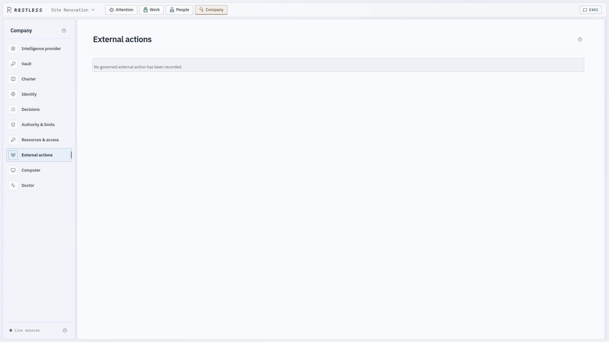

*No governed external action is recorded in this company. The screenshot shows the
surface, not proof of a successful external transaction.*

### Diagnose the real execution path

Doctor brings together authority, organisational state and company-runtime checks.
It exposes which boundary is available so an empty or disconnected surface need not
be mistaken for a healthy system.

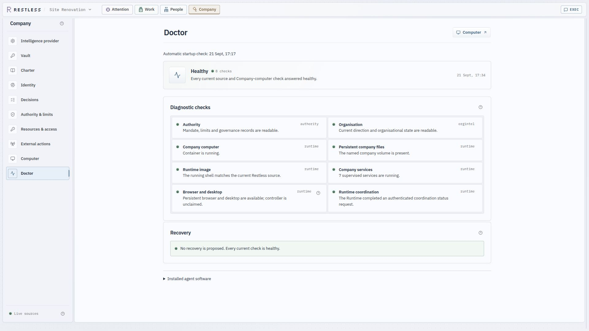

*The checks shown were healthy at capture time. Earlier in this session the computer
entry had not passed its probe; after the available state appeared, the actual desktop
was opened and captured above. These checks do not validate every workflow or the
separate document collaboration connection.*

### Follow outcomes and revisions

Work shows outcomes and their current state. Switch between the dependency map and
the board to understand what is next, in motion, waiting or complete.

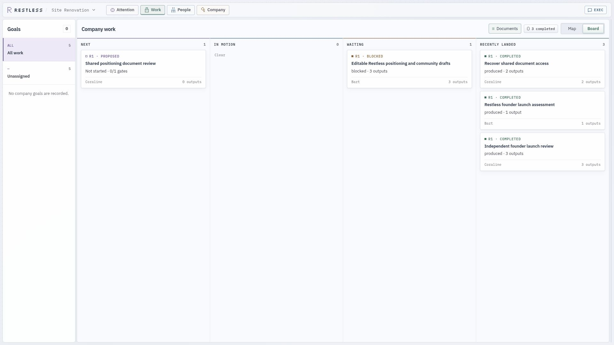

### See the company at a glance

The interactive company floor provides a spatial view of colleagues and teams. It is
another entry point to the same work, alongside the focused Attention, Work, People
and Company surfaces.

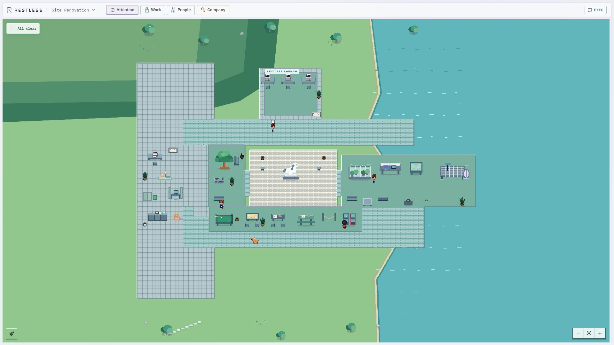

Native document collaboration is also part of the product, but its editor stayed in
“Connecting” during this capture session. We have not substituted a mockup or claimed
a successful simultaneous editing session. The game-studio scenario above remains an
illustration until exercised with real participants.

## Alternatives

There are good reasons to choose another tool. Restless shares capabilities with many
of these projects; its emphasis is the combination of founder attention, collaboration
on deliverables, and proportionate orchestration.

This comparison describes product approaches, not a performance ranking. Links point
to the projects' own descriptions. Features change; please open an issue or PR if a
comparison is inaccurate.

| Tool | Consider it when… | How Restless differs in emphasis |
| --- | --- | --- |
| [Paperclip](https://github.com/paperclipai/paperclip) | You want to manage an agent organisation through roles, goals, issues, budgets and bring-your-own runtimes. | Restless starts from the owner's conversation, attention and collaborative work surface. Both target business operations and retain internal accountability. |
| [OpenClaw](https://github.com/openclaw/openclaw) | You want a general assistant across your devices and communication channels, with extensible tools and agent routing. | Restless centres an ongoing business workspace and prepared decisions. Browser, terminal and file capabilities overlap. |
| [Lindy](https://docs.lindy.ai/teammate/home) | You want a hosted business teammate working through connected tools and routines. | Restless Core provides a local company appliance with an inspectable implementation. Lindy also documents attention cards and editable files. |
| [Manus](https://manus.im/desktop) | You want to delegate general tasks to an agent with computer-based execution. | Restless emphasises continuing business context, accountable work and collaboration around review. General execution is shared territory. |
| [Relevance AI](https://relevanceai.com/workforce) | You want to configure specialist agents and connect them into a workforce. | Restless aims to reduce the workforce design the owner must do before getting useful work. |
| [n8n](https://github.com/n8n-io/n8n) | You can describe a repeatable process and want explicit workflows and integrations. | Restless focuses on work whose approach changes through judgement, discussion and revision. Explicit workflows can be the clearer choice for stable automation. |
| [Dify](https://github.com/langgenius/dify) | You want to build AI applications with workflows, knowledge retrieval and model tooling. | Restless is the business workspace itself, rather than a platform for building one. |
| [OpenHands](https://github.com/OpenHands/OpenHands) / [Gas Town](https://github.com/gastownhall/gastown) | Your primary work is software engineering and coordinating coding agents. | Restless treats non-code business deliverables as primary work alongside software. |
| [CrewAI](https://github.com/crewAIInc/crewAI) / [LangGraph](https://github.com/langchain-ai/langgraph) / [Microsoft Agent Framework](https://github.com/microsoft/agent-framework) | You need to build your own agent application and control its execution model. | Restless provides an opinionated owner experience. Frameworks offer more freedom to build a different one; their applications are not limited to coding. |

### Collaboration and execution features

“Not established” means the reviewed sources did not establish an equivalent feature,
not that the product cannot support it. This table describes capability shape, not quality.

| Feature | Restless | Paperclip | OpenClaw | Lindy | n8n / Dify |
| --- | --- | --- | --- | --- | --- |
| Human multiplayer | Human membership, scoped conversations and collaborative documents; integration in progress | Multiple human users, roles, task discussions | Shared channels and team deployment; document co-editing not established | Team context/files with role-dependent editing | Shared workflow/app building; different collaboration surface |
| Native documents | Collaborative editor, versions and anchored comments | Versioned issue documents and annotations | File/review panels; rich-text co-editing not established | Editable, versioned files | Document integrations or knowledge inputs; equivalent editor not established |
| Attention | Prepared decision briefs and owner/lead routing | Ranked attention feed and approvals | Session/task panels | Attention cards | Configured human-input/review steps |
| Browser/computer | Persistent company computer with user takeover | Execution depends on runtime; optional browser skill | Managed browser and optional computer-use capability | Equivalent shared desktop not established | Tools, plugins or browser integrations |
| Model choice | Codex, Claude, API providers and compatible gateways | Bring-your-own agent runtimes | Multiple models and harnesses | Hosted provider/model options depend on product | Multiple provider integrations |

Sources: [Paperclip](https://github.com/paperclipai/paperclip),
[OpenClaw panels](https://docs.openclaw.ai/web/control-ui/panels),
[Lindy files](https://docs.lindy.ai/teammate/files),
[n8n](https://github.com/n8n-io/n8n), [Dify](https://github.com/langgenius/dify).

### A closer look at Paperclip

Paperclip is the closest comparison in business scope. Its explicit company and task
model may be exactly what you want when managing a roster of agents and their work.

Restless is for the owner who wants to spend more time directing and improving outcomes
and less time managing the organisation that produces them. That is a design choice
we need to prove through the experience, not a claim that Paperclip lacks the features:
it has a [ranked attention API](https://docs.paperclip.ing/reference/api/attention/),
[native issue documents](https://docs.paperclip.ing/guides/day-to-day/issues/), and an
[experimental conversational task layout](https://docs.paperclip.ing/experimental/task-chat/).

Choose on the workflow you prefer and the results you get. We do not yet have a
controlled comparison demonstrating that Restless produces better outputs or requires
less supervision.

## Architecture

Restless separates three responsibilities:

| Layer | Responsibility |
| --- | --- |
| **Constitutional Kernel** | Authority, credentials, budgets, external effects and recovery. |
| **Organisational Intelligence (OrgIntel)** | Goals, accountable work, actors, conversations and coordination. |
| **Company Linux Runtime** | The persistent computer where agents use tools, edit files and produce results. |

The kernel bounds consequential actions. OrgIntel coordinates the work. The runtime
provides the environment to do it. These are responsibility boundaries, not a mandatory
sequence of model calls.

Read [ARCHITECTURE.md](ARCHITECTURE.md) for the design and
[coordination theory](docs/COORDINATION_THEORY.md) for the current reasoning behind team
shape. Architecture documents include intended behaviour; code and observed runs
establish what has been delivered.

## Contributing

Start with the [working agreement](CLAUDE.md), [architecture](ARCHITECTURE.md), and the
relevant [sprint](docs/sprints/README.md). The most useful contributions close a real
workflow gap and show the resulting output or behaviour.

| Path | Contents |
| --- | --- |
| `crates/restlessd/` | Coordination daemon and owner APIs |
| `crates/restless/` | Operator CLI |
| `crates/restless-orgintel/` | Recoverable company and work state |
| `crates/restless-model-gateway/` | Model routing and spend accounting |
| `infra/company-image/` | Persistent company computer |
| `services/native-documents-collaboration/` | Document collaboration service |
| `web/` | Owner workspace |
| `experiment/` | Experiment designs and recorded results |

The hosted control plane and public website live in a separate private repository.
This repository contains the local company core, architecture and experiment evidence.

## License

Restless Core is licensed under [Apache 2.0](LICENSE). The Restless name, marks,
visual identity, hosted service and private cloud control plane are not licensed by
this repository.
