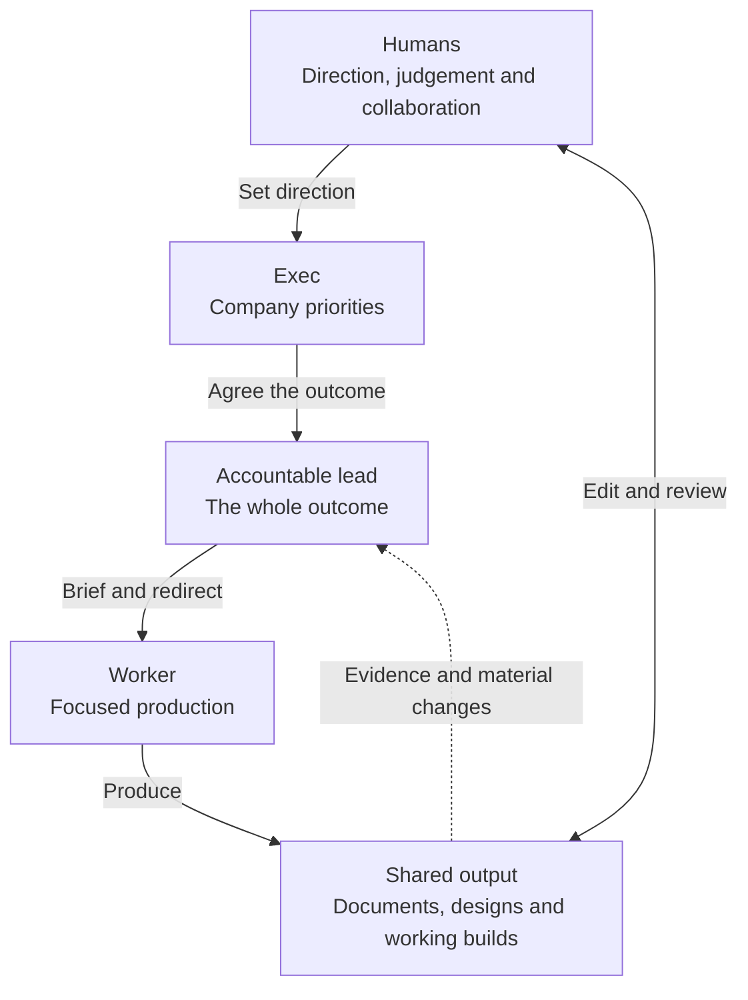
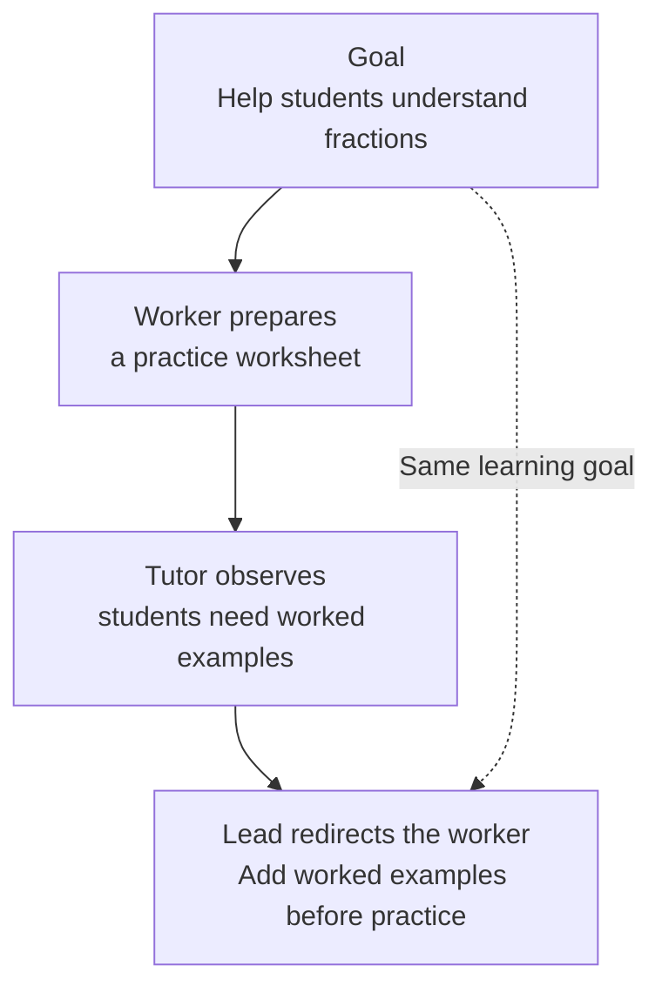
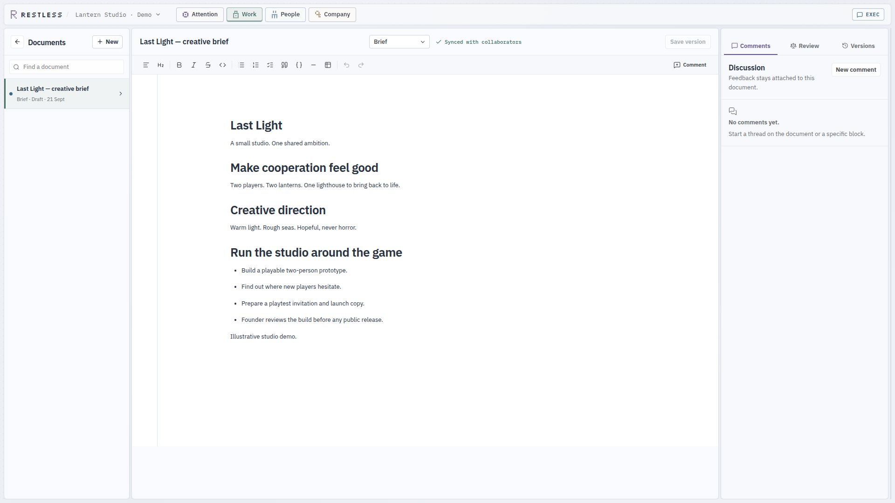
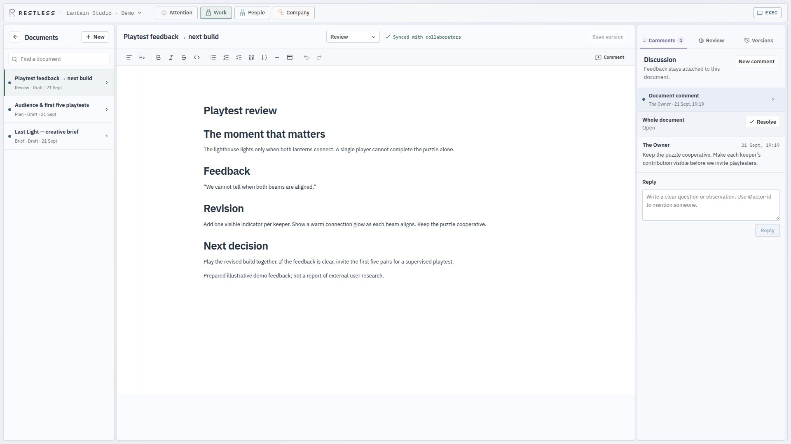
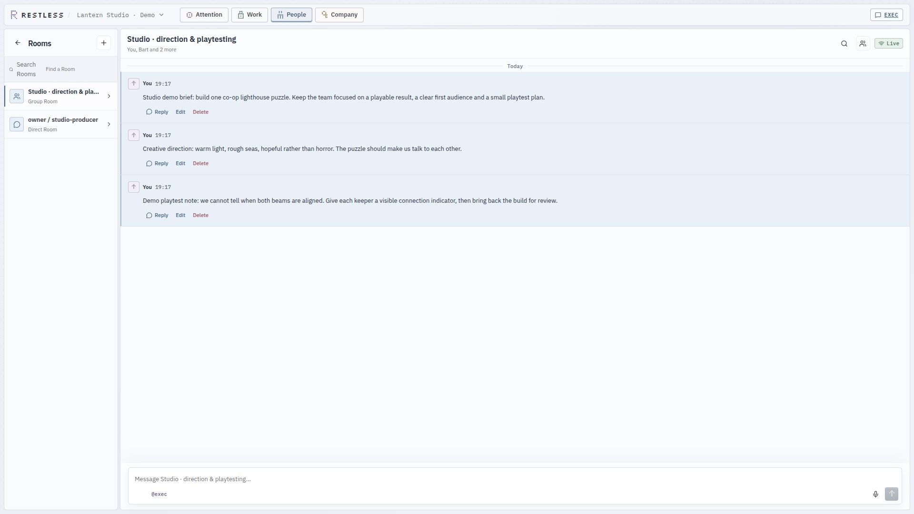
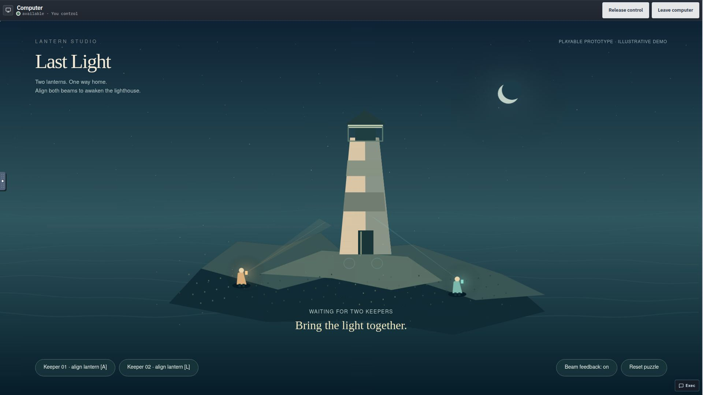

# Restless

https://github.com/user-attachments/assets/3cbfd3ce-89a7-4155-bc3f-15505609dfcb

**Run your business with AI. Spend your attention on the work that needs you.**

Restless is an open-source, multiplayer AI workspace for founders and teams.
Humans and AI agents share documents, conversations, ongoing work and a persistent
company computer. Set direction, shape the output together, and make the decisions
that need your judgement. Agents carry the work forward.

**Bring your people. Bring Codex, Claude, or your preferred API provider.**

Research a market. Develop a product. Prepare a sales proposal. Run operations.
Restless brings the work, the people and the tools into one place.

[Why Restless](#why-restless) · [OrgIntel](#orgintel-a-company-that-carries-the-work-forward) ·
[Features](#features) · [Product tour](#product-tour) ·
[Getting started](#getting-started) · [Alternatives](#alternatives) ·
[Architecture](#architecture) · [Contributing](#contributing)

> **Development preview:** a runnable local company workspace under active development.
> Start from a development checkout; interfaces are evolving.

**Try it with a real piece of work:** [install Restless](#getting-started), then
[prepare your first client proposal](docs/first-outcome.md).
[Get setup help](https://github.com/BlueprintLabIO/restless-core/issues/new?template=setup-help.yml)
or [tell us what you want to run with Restless](https://github.com/BlueprintLabIO/restless-core/issues/new?template=founder-feedback.yml).

## Why Restless

AI makes it easier to produce work. It can also give you another organisation to manage:
more conversations, handoffs, status reports and decisions competing for your attention.

We believe a business harness should help you **work with AI on the result**. The
measure of success is useful output and the human attention it takes to get there.

### Human multiplayer, from the start

Bring your cofounder, designer, operator or reviewer into the same company. People
work alongside agents with their own accounts and permissions. Discuss the work
in rooms, edit shared documents, and keep feedback beside the thing you are improving.

Human collaboration is central to Restless. A business can be run by several people,
with AI contributing around them.

### Your attention is part of the budget

A decision should arrive prepared: the context, the recommendation, the relevant
output and what happens next. Leads own their work and resolve routine coordination.
Attention brings you into the places where your judgement or participation matters.

### Collaborate on the output

Open the actual proposal, plan, page or prototype. Revise the document, leave a comment,
ask a question, or take over the company computer. The executive conversation stays
alongside the work, so you can steer without rebuilding context in another tool.

### Start with the smallest useful team

One capable worker can often handle a whole piece of work. Add a specialist when their
expertise, independent checks or help working in parallel improves the result. Everyone
should know what they own, and the extra coordination should be worth it.

This principle is grounded in our [coordination experiments](experiment/coordination/experiments/EXP-17/RESULTS.md).
We measure the cost of coordination and use that evidence to shape the system.

### Finish with something you can use

Work should finish with something you can use: a document, a working page, a file or
a live application. Feedback stays attached to the version you reviewed, so the team
knows what to improve next.

## OrgIntel: a company that carries the work forward

Your company should remember its commitments, people, knowledge and unfinished work
after a conversation ends. **OrgIntel — Organisational Intelligence — gives Restless
that memory and continuity.** An agent can switch models, restart or hand work over
without losing the goal, who owns it, what has been learned or what happens next.

Its design spans four kinds of work:

| Mode | What it means for the business |
| --- | --- |
| **Explore** | Investigate an uncertain market, compare approaches and decide which evidence would justify investment. |
| **Execute** | Carry an agreed outcome through production, review and delivery with a clear owner. |
| **Repair** | Respond to failed checks, broken tools, lost sessions or changed requirements while preserving useful work. |
| **Evolve** | Turn experience into better company knowledge, examples and reusable practices. |

These modes describe how we want a company to operate. Restless supports them by
remembering goals and responsibilities, following up on a schedule or when something
changes, tracking revisions, recovering interrupted work and using company guidelines
you have approved.

### Responsibility that outlives a model call

**Keep the goal in view while agents work through the details.** An agent can get
absorbed in fixing one problem and lose sight of why the work matters. Restless gives
agents responsibility at different levels to help reduce this tunneling:



The lead stays outside day-to-day production so it can question the approach while a
worker concentrates on execution. Goals, briefs and decisions live beyond any one
agent session. The team can change tactics or replace a stuck worker while keeping
the agreed outcome and constraints visible.

For a tutoring business, a worker might prepare lesson materials. The lead asks
whether those materials address the students’ learning needs; Exec balances that
work with enrolment and operations. The human tutors bring their teaching judgement
and can change the direction together.

**Change the approach; keep the learning goal.** For example:



The feedback changes the brief. The learning goal remains available to the lead and
worker, so producing more worksheets does not become the goal in itself.

Start with one capable worker beneath each lead. Add researchers, reviewers or
specialists when they help. Leads can talk directly when their work overlaps.

**A lead can stay responsible without narrating every step.** For a clearly defined
assignment, Restless can pass the brief to a worker and check the result automatically.
The lead steps in when checks fail, requirements are unclear, a worker gets stuck or
you change direction. Model calls go to the decisions that need them.

### Quality is part of the brief

Choose **Fast, Thorough, Exceptional or Frontier** as the company default or for a
particular outcome. The standard guides how deeply agents investigate, develop and
review the result. You set permissions and spending limits separately.

Each review records the version you saw, the material it used, the checks it passed
and the changes you requested. If that material changes, Restless can flag work that
relied on the old version for another pass. Play the game, read the proposal, inspect
the page: judge the thing your business will actually use.

### A company that knows what it stands for

Company Identity gives agents four distinct sources of direction:

| Pillar | What it carries |
| --- | --- |
| **Truth** | Approved product facts, claims, evidence and the boundaries of what the company can say. |
| **Voice** | Writing examples and guidance for different audiences and formats, with room for each human author to sound like themselves. |
| **Visual language** | Design references, reusable elements, examples you like or dislike, and screenshots of the actual result. |
| **Culture** | How the company handles disagreement, uncertainty, correction and customers, grounded in decisions and conduct. |

Work that uses your company identity gets a saved version of its facts and guidelines.
The outputs can record which facts and examples they used. When those change, Restless
can flag the affected outputs so you can keep, update or remove them. Agents can
suggest improvements to the guidelines, with supporting examples, for you to approve.

For example, when you correct a product fact, Restless can flag the sales page that
still uses the old claim. You can ask for that page to be updated. New work uses the
correction, and you can still see which guidelines earlier work followed.

The [Company Identity run](docs/dogfood/company-identity/s35-run-report.md) exercises this
across two different businesses. Read the [OrgIntel specification](docs/specs/orgintel.md)
for the wider design, and the [capability evidence guide](docs/product-capabilities.md)
to see how these features work.

## Features

### Work together

| Capability | What you can do |
| --- | --- |
| **Human multiplayer** | Bring cofounders and colleagues into the same workspace as your AI agents, with their own accounts and permissions. |
| **Collaborative documents** | Co-edit rich-text documents with live sync, named versions and exports. Built on **Tiptap, Yjs and Hocuspocus**. |
| **Comments and document review** | Comment on a passage or the whole document, resolve discussions and compare proposed edits with the original. |
| **Rooms and conversations** | Talk one-to-one or in groups, and choose which people and agents take part. |
| **Attention** | Open the decisions, outcome reviews and requests that need your judgement, with the relevant work and evidence attached. |
| **Executive conversation** | Steer the company through a persistent conversation beside the active workspace. |
| **Ready for your input** | Get the work prepared for the specific step only you can take, with a clear way for agents to continue afterwards. |
| **See what happened next** | Follow what your decision made possible, who picked up the work and whether it finished or got stuck. |

### Run ongoing company work

| Capability | What you can do |
| --- | --- |
| **Goals that survive restarts** | Keep the goal, who is responsible and the work history when an agent session ends or restarts. |
| **Different levels of responsibility** | Keep company priorities with Exec, the whole outcome with its lead, and focused production with workers. |
| **Work board and dependency map** | See who is doing what, which work is waiting on something else and what needs another pass. |
| **Supervision when it matters** | Bring a lead in when requirements change, checks fail or work gets stuck. Routine progress can pass without another model call. |
| **Schedules and follow-ups** | Set one-off or recurring weekday jobs, see when they ran and choose how to handle missed runs. |
| **The right context for each agent** | Give agents the goals, messages, decisions and sources they need, and save enough context to pick up later. |
| **Memory with sources** | Keep track of what was observed, what is an assumption and what was decided, including where information came from and how current it is. |
| **Reusable company know-how** | Keep instructions, skills, scripts and internal tools in the company workspace and version them with the work. |

### Set the standard and improve the result

| Capability | What you can do |
| --- | --- |
| **Outcome standards** | Choose Fast, Thorough, Exceptional or Frontier for the company or an individual outcome. |
| **Review the actual result** | Try the application, read the document, open the page or play the media you are reviewing. |
| **Know which version was checked** | Keep the reviewed version unchanged, with a record of the material it used and the checks run on it. |
| **Revisions and related work** | Carry feedback into the next version and flag other work that relied on material you changed. |
| **Independent review** | Give a separate reviewer the result and the information needed to check it. |
| **Company Identity** | Save approved company facts, writing style, design guidance and ways of working, with a history of changes. |
| **Keep company content up to date** | Flag outputs that use outdated company facts or guidelines, decide what to update and approve lessons from the work. |
| **Pick up interrupted work** | Keep files and work history, identify what went wrong and give the next session the information it needs to recover. |

### Give the company a real computer

| Capability | What you can do |
| --- | --- |
| **Persistent Linux workspace** | Use ordinary files, Git, toolchains, packages and applications in a company environment that survives agent sessions. |
| **Embedded desktop** | Enter the company computer, inspect the result and take control to participate directly. |
| **Persistent browser** | Research, inspect live pages and work through browser tools in the company environment. |
| **Internal tools and services** | Build scripts, dashboards, prototypes and local applications with the tools the business needs. |
| **Codex, Claude and API providers** | Connect native agent harnesses, model APIs and compatible gateways. |
| **Per-agent intelligence** | Inherit a company model or choose a connection and model for a particular agent. |
| **CLI and APIs** | Operate the company, inspect work and automate interactions from the terminal. |
| **Multiple companies** | Switch between distinct businesses with their own work, people and company environments. |

### Keep autonomy accountable

| Capability | What you can do |
| --- | --- |
| **Permissions and ongoing approvals** | Choose what agents may do on their own and what needs your approval. Code enforces these rules. |
| **Membership, roles and permissions** | Control who can enter the workspace, who is responsible for each job and who may act on connected services. |
| **Budgets and spending** | Set model spending limits and see which requests used the budget or were stopped by the limit. |
| **Vault — powered by Infisical** | Store credentials through an established secrets backend and keep secret references in company configuration. |
| **Records of external actions** | See what was authorised and what happened. If an action’s result is unclear, Restless requires it to be checked before retrying. |
| **Resources and Doctor** | See which tools and services are available, when they were last checked and what needs fixing. |
| **Work that survives agent sessions** | Keep company files when an agent stops. Restoring the computer does not erase records of actions already taken. |
| **Company floor** | Explore colleagues and teams through an interactive spatial view of the same company. |

[How these features work, with code and examples →](docs/product-capabilities.md)

## Getting started

Use a **Linux host with Rust/Cargo, Node.js 24/npm, Docker with Compose v2,
curl, jq and OpenSSL**. Start Docker and keep at least 30 GiB free for the source build and company image.
The launcher builds the daemon and company image, installs its pinned model
broker, and provisions PostgreSQL and an Infisical vault for a new development profile.

```sh
git clone --branch dev https://github.com/BlueprintLabIO/restless-core.git
cd restless-core
npm --prefix web ci
```

### Choose your intelligence

| Connection | Setup |
| --- | --- |
| **Codex** | Connect the native Codex harness using sign-in or an OpenAI API key. |
| **Claude** | Connect the native Claude harness using sign-in or an Anthropic API key. |
| **API providers** | Use OpenAI, Anthropic, Google Gemini, OpenRouter, Groq, Mistral, DeepSeek, xAI, Moonshot, Z.ai and other supported connections. |
| **Custom endpoints** | Configure an OpenAI-compatible gateway with your endpoint, model IDs and credentials. |

Start the workspace, then open the setup URL printed in your terminal and connect
**Codex, Claude or an API provider** in **Company → Intelligence**:

```sh
./scripts/restless-dev demo_test --reconcile
```

You can also initialise an API-backed company with a model and a key already in your shell:

```sh
export RESTLESS_DEV_MODEL=anthropic/claude-sonnet-4-6
export RESTLESS_DEV_CREDENTIAL_REFERENCE=env:ANTHROPIC_API_KEY
./scripts/restless-dev demo_test --reconcile
```

Existing companies retain their saved configuration.

Open the workspace address printed by the launcher. In another terminal, verify setup:

```sh
./scripts/restless-dev doctor demo_test
```

Ctrl-C stops the foreground host processes; company containers and volumes persist.
See [web development](web/README.md) and [build storage](docs/BUILD_STORAGE.md) for details.

To start a new company with teammates, follow the [self-hosted accounts setup](services/identity/README.md).
It provides separate sign-ins, email invitations and removal of member access.

Try [your first useful outcome](docs/first-outcome.md): delegate a client proposal,
review the shared document, and ask for a revision.

## Example: a game studio, humans and AI together

**Lantern Studio** is the example business in the walkthrough. Its brief: make a small
co-op lighthouse game, find an audience and prepare the first playtest.

| Teammate | Contribution |
| --- | --- |
| Human creative director | Sets direction, co-edits the brief and approves the playable result. |
| Human artist / playtester | Adds references, tests the game and leaves specific feedback. |
| AI production lead | Owns the outcome and brings prepared decisions to the humans. |
| AI developer | Builds and revises the prototype in the company computer. |
| AI researcher or QA specialist | Contributes audience research or independent testing when useful. |

1. **Shape the brief together.** Agree on the experience, scope and what makes it good.
2. **Make the work.** Build the prototype, prepare the audience plan and draft the invitation.
3. **Review the actual result.** Play the game and leave feedback beside the build and brief.
4. **Revise and decide.** Improve the confusing parts, review the next version and approve the playtest.

The same loop works for a consultancy preparing a client proposal, a founder researching
a new market, or an operations team improving an internal process. The business changes;
the shared workspace and the way people collaborate with AI stay familiar.

## Product tour

Real development UI, including the Lantern Studio example. Screenshots and video share
a **1920 × 1080 (16:9)** frame. [Capture details and captions](docs/media/README.md).

### Write and revise together

Native documents bring the brief, working draft, comments and version history into one
surface. Live sync keeps collaborators on the same document.



### Keep feedback attached to the result

Discuss a document or a specific passage, resolve comments, and carry the requested
changes into the next version. Review happens in the workspace where the work lives.



### Share a room with the people and agents involved

Direct and group rooms give ongoing discussions an explicit audience. Keep direction,
questions and feedback together while documents and the company computer hold the work.



### Enter the company computer

Agents work in a persistent Linux environment with a browser, files and applications.
Open its desktop inside Restless, inspect the result, and **Take control** when you
want to participate directly. Here, the studio's playable prototype is open in the computer.



### Set authority and permissions

Choose what the company may do independently and which decisions require you.
**Authority & limits** brings autonomy, outcome standards, model spend ceilings and
standing grants into one visible surface.


### Give roles clear accountability

People connects each role to its current work and accountable lead. See who is producing,
who owns the outcome and where to take a question.


### Choose intelligence per agent

A researcher, lead and reviewer can use different models and connections. Inherit the
company choice or assign intelligence directly beside the person's role.


### Connect your preferred provider

Native Codex and Claude connections sit alongside API providers and compatible gateways.
API connections can store credentials in Infisical and keep only references in company settings.


### Know what the company can use

**Resources & access** reports available capabilities with their observed state, source
and timestamp. Doctor checks the execution path so you can find and fix a broken boundary.


### Keep credentials in a real vault

**Vault is based on [Infisical](https://github.com/Infisical/infisical).** Restless uses
its secret storage and machine identity through a host-side adapter. The owner can
inspect credential inventory without displaying secret values. Restless owns the
authority checks and controls how credentials reach the relevant provider or harness.


### Follow outcomes and revisions

Use the work board for current state or the dependency map for relationships between
outcomes. Keep the result, accountable lead and revision history connected.


### See the company at a glance

The company floor is an interactive view of colleagues and teams, connected to the
same work available through Attention, Work, People and Company.


## Alternatives

### Why choose Restless over Paperclip?

**Choose Restless when you want to run the business alongside AI, with your team
working directly on the output.**

[Paperclip](https://github.com/paperclipai/paperclip) organises an agent company through
roles, goals, issues, budgets and agent runtimes. It is a strong fit when you want that
agent-management model. Its [issue workflow](https://docs.paperclip.ing/guides/day-to-day/issues/)
lets a CEO agent create and delegate work, with humans reviewing progress and approvals.

Restless starts from a different question: **what useful work can we complete together,
and where does human judgement improve it?**

- **Participate in the result.** Your cofounder can revise the brief, a colleague can
  comment on the proposal, and you can enter the company computer to try the build.
- **Make attention purposeful.** Bring the relevant output and a prepared decision to
  the owner. Keep routine coordination with the accountable lead.
- **Keep the team as simple as the work allows.** Start with a capable worker. Add
  collaborators when they improve quality, provide an independent check or save time.
- **Help agents understand your company.** Give them approved facts, writing style,
  design guidance and ways of working. Track which guidance each output used.
- **Make quality an operating choice.** Set an outcome standard, review the exact result
  and carry feedback into the next version.
- **Keep business context together.** Documents, rooms, work, roles and the computer
  belong to the same ongoing company.

Paperclip also offers [human membership](https://docs.paperclip.ing/guides/org/members-and-access/),
[ranked attention](https://docs.paperclip.ing/reference/api/attention/) and
[versioned issue documents](https://docs.paperclip.ing/guides/day-to-day/issues/).
The choice is the working relationship you want: Restless puts collaborative production
and the owner's attention at the centre of its design.

### Features at a glance

**✓** Built in · **◐** Related feature, or possible with setup or integrations ·
**—** Not built in · **?** Not confirmed in the sources.
Features can vary by plan, connected tools or rollout. Sources checked **22 September 2026**.

#### Working together

| Feature | Restless | Paperclip | OpenClaw | Lindy | n8n | Dify |
| --- | :---: | :---: | :---: | :---: | :---: | :---: |
| Business work beyond coding | ✓ | ✓ | ✓ | ✓ | ✓ | ✓ |
| Shared workspace for human teammates | ✓ | ✓ | ◐ | ✓ | ✓ | ✓ |
| Multiple agents and delegation | ✓ | ✓ | ✓ | ✓ | ✓ | ✓ |
| Group chats with people and agents | ✓ | ◐ | ✓ | ✓ | ◐ | ◐ |
| Built-in document or file editing | ✓ | ✓ | ✓ | ✓ | ◐ | ◐ |
| Edit formatted documents together, live | ✓ | ◐ | ? | ◐ | ◐ | ◐ |
| Inbox for decisions and requests | ✓ | ✓ | ◐ | ✓ | ◐ | ◐ |
| View files or try interactive results | ✓ | ✓ | ✓ | ✓ | ◐ | ✓ |
| Built-in desktop you can control | ✓ | ◐ | ✓ | ? | ◐ | ◐ |
| CLI or API access | ✓ | ✓ | ✓ | ◐ | ✓ | ✓ |

#### Keeping work moving

| Feature | Restless | Paperclip | OpenClaw | Lindy | n8n | Dify |
| --- | :---: | :---: | :---: | :---: | :---: | :---: |
| Company goals and clear responsibilities | ✓ | ✓ | ◐ | ◐ | ◐ | ◐ |
| Agent profiles or conversation memory | ✓ | ✓ | ✓ | ✓ | ✓ | ✓ |
| Scheduled work and recurring routines | ✓ | ✓ | ✓ | ✓ | ✓ | ✓ |
| Reusable instructions, skills or playbooks | ✓ | ✓ | ✓ | ✓ | ◐ | ◐ |
| Recover or retry failed work | ✓ | ✓ | ✓ | ✓ | ✓ | ✓ |
| Bring Codex / Claude agent runtimes | ✓ | ✓ | ✓ | ? | ◐ | ◐ |
| Multiple model providers | ✓ | ✓ | ✓ | ◐ | ✓ | ✓ |
| Choose models for agents or workflow steps | ✓ | ✓ | ✓ | ◐ | ✓ | ✓ |
| General visual workflow editor | — | ? | ? | ✓ | ✓ | ✓ |
| Self-hostable core | ✓ | ✓ | ✓ | ? | ✓ | ✓ |

#### Quality, company identity and authority

| Feature | Restless | Paperclip | OpenClaw | Lindy | n8n | Dify |
| --- | :---: | :---: | :---: | :---: | :---: | :---: |
| Human approvals and permissions | ✓ | ✓ | ✓ | ✓ | ✓ | ✓ |
| Use review feedback in the next revision | ✓ | ✓ | ◐ | ◐ | ✓ | ✓ |
| See model usage or costs | ✓ | ✓ | ✓ | ✓ | ◐ | ✓ |
| Enforce model spending limits for companies or agents | ✓ | ✓ | ? | ◐ | ◐ | ◐ |
| Track the reviewed version, its sources and revisions | ✓ | ◐ | ? | ? | ◐ | ◐ |
| Set quality standards for the company or a piece of work | ✓ | ◐ | ◐ | ◐ | ◐ | ◐ |
| Track which approved company facts and guidelines each job uses | ✓ | ◐ | ◐ | ◐ | ◐ | ◐ |
| Flag outdated content when company facts or guidelines change | ✓ | ? | ? | ? | ? | ? |
| Store and manage API keys and credentials | ✓ | ✓ | ✓ | ✓ | ✓ | ✓ |
| Control access to connected tools | ✓ | ✓ | ✓ | ✓ | ✓ | ✓ |

**The distinctions behind the ticks:**

- **Collaboration:** Paperclip has versioned issue documents and artifact previews;
  OpenClaw has file, browser and capability-dependent desktop panels; Lindy has team
  files and hosted artifacts. Restless combines a native shared editor, rooms and the
  company computer around the same ongoing work.
- **Continuity:** schedules, memory and recovery are common strengths across this
  category. Restless keeps track of who owns the work, what has been tried and what
  needs your input. A lead stays responsible without a model call for every update.
- **Quality and identity:** an alternative's ◐ credits related prompts, skills, knowledge
  or workflows. Restless lets you set a quality standard, record which approved company
  guidance each job used and flag content affected by changes to that guidance.
- **Automation:** n8n, Dify and Lindy provide visual workflow building. Restless's work
  graph describes outcomes and revisions; reusable automation lives in company tools
  and scripts. It is not a general drag-and-drop workflow editor.

The [comparison notes and sources](docs/product-capabilities.md#comparison-notes-and-sources)
explain the scope of these rows. Corrections are welcome through an issue or PR.

### When another tool is a better fit

| Alternative | Choose it for |
| --- | --- |
| [Paperclip](https://github.com/paperclipai/paperclip) | Managing an agent organisation through tasks, roles, budgets and bring-your-own runtimes. |
| [OpenClaw](https://github.com/openclaw/openclaw) | A general assistant across devices, messaging channels and extensible tools. |
| [Lindy](https://docs.lindy.ai/teammate/home) | A hosted business assistant connected to email, meetings and team tools. |
| [Manus](https://manus.im/desktop) | Delegating general tasks with computer-based execution. |
| [Relevance AI](https://relevanceai.com/workforce) | Configuring specialist agents and workflows into a workforce. |
| [n8n](https://github.com/n8n-io/n8n) | Explicit, repeatable automation with visual workflows and integrations. |
| [Dify](https://github.com/langgenius/dify) | Building AI applications, retrieval pipelines and agentic workflows. |
| [OpenHands](https://github.com/OpenHands/OpenHands) / [Gas Town](https://github.com/gastownhall/gastown) | Software engineering and coordinating coding agents. |
| [CrewAI](https://github.com/crewAIInc/crewAI) / [LangGraph](https://github.com/langchain-ai/langgraph) / [Microsoft Agent Framework](https://github.com/microsoft/agent-framework) | Building your own agent application and controlling its execution model. |

## Architecture

Restless separates three responsibilities:

| Layer | Responsibility |
| --- | --- |
| **Constitutional Kernel** | Authority, credentials, budgets, external effects and recovery. |
| **Organisational Intelligence (OrgIntel)** | Goals, accountable work, actors, context, review, company identity and coordination. |
| **Company Linux Runtime** | The persistent computer where agents use tools, edit files and produce results. |

The kernel bounds consequential actions. OrgIntel coordinates the work. The runtime
provides the environment to do it.

### Built on established tools

| Foundation | Role in Restless |
| --- | --- |
| [Infisical](https://github.com/Infisical/infisical) | Vault storage and machine identity, behind Restless's credential adapter. |
| [Tiptap](https://github.com/ueberdosis/tiptap), [Yjs](https://github.com/yjs/yjs), [Hocuspocus](https://github.com/ueberdosis/hocuspocus) | Rich-text editing, shared document state and collaboration transport. |
| [PostgreSQL](https://www.postgresql.org/) | Durable company, work and collaboration state. |
| Linux and Docker / OCI | Persistent company execution environments, files, processes and applications. |
| Rust | Daemon, CLI, coordination and model gateway. |
| SvelteKit | The human workspace: Attention, Work, People and Company. |
| Codex and Claude | Native agent harnesses, alongside Restless-managed API execution. |

Read [ARCHITECTURE.md](ARCHITECTURE.md) and [coordination theory](docs/COORDINATION_THEORY.md)
for the responsibility boundaries and team design.

## Contributing

Start with the [working agreement](CLAUDE.md), [architecture](ARCHITECTURE.md), and the
relevant [sprint](docs/sprints/README.md). The most useful contributions close a real
workflow gap and show the resulting output or behaviour.

| Path | Contents |
| --- | --- |
| `crates/restlessd/` | Coordination daemon and owner APIs |
| `crates/restless/` | Operator CLI |
| `crates/restless-orgintel/` | Recoverable company and work state |
| `crates/restless-model-gateway/` | Model routing and spend accounting |
| `infra/company-image/` | Persistent company computer |
| `services/native-documents-collaboration/` | Document collaboration service |
| `web/` | Owner workspace |
| `experiment/` | Experiment designs and recorded results |

The hosted control plane and public website live in a separate private repository.
This repository contains the local company core, architecture and experiment evidence.

## License

Restless Core is licensed under [Apache 2.0](LICENSE). The Restless name, marks,
visual identity, hosted service and private cloud control plane are not licensed by
this repository.
