# Restless

https://github.com/user-attachments/assets/3cbfd3ce-89a7-4155-bc3f-15505609dfcb

**Work together.**

An open-source office for people and AI agents. Share the work, keep the taste.

Restless gives your team and its agents one place to work: rooms, shared documents, a board
of work and a real Linux computer. People bring the taste and judgement that make the business
theirs. Agents carry the chores around it. Only judgement reaches a person, and the work keeps
moving after everyone goes home.

`Apache 2.0` · `Self-hosted` · `Codex, Claude or any model` · `Development preview`

[restless.run](https://restless.run) · [Hosted waitlist](https://restless.run/cloud/#waitlist) ·
[Blog](https://restless.run/blog/) · [Get started](#get-started)

> **Development preview.** Restless runs today on your own Linux machine. Interfaces are
> still moving, and we would rather hear what broke than have you guess.

**Try it on a real piece of work:** [install Restless](#get-started), then
[prepare your first client proposal](docs/first-outcome.md).
[Get setup help](https://github.com/BlueprintLabIO/restless-core/issues/new?template=setup-help.yml)
or [tell us what you want to run with it](https://github.com/BlueprintLabIO/restless-core/issues/new?template=founder-feedback.yml).

[A day at the studio](#a-day-at-the-studio) · [Attention is the budget](#attention-is-the-budget) ·
[People and agents](#people-bring-the-taste-agents-carry-the-chores) ·
[Why a team](#why-a-team) · [OrgIntel](#orgintel-a-company-not-a-chat-log) ·
[What's inside](#whats-inside) · [Any model](#bring-your-people-bring-any-model) ·
[Get started](#get-started) · [Product tour](#product-tour) · [Alternatives](#alternatives) ·
[Architecture](#architecture) · [Contributing](#contributing)

## A day at the studio

[restless.run](https://restless.run) tells this as one scroll through a day on the company floor.
**Lantern Studio** is the example business: a small studio making a two-player lighthouse game
and preparing its first playtest.

| Time | What happens |
| --- | --- |
| **09:10** | **Start together.** You and Rosa, the artist, set the week in a room. Exec turns it into a goal: playtest-ready by Friday, owned by Marlow. |
| **10:30** | **Shape it together.** One brief, three cursors. Rosa brings the taste; Marlow, the lead agent, turns it into work. |
| **12:00** | **Agents do the legwork.** Theo's team compares five co-op launches. The answer lands in a document you can read, with every number linked to its source. |
| **13:30** | **People read people.** Kit runs the playtest. Camille, an agent, sends the invitations and sorts the feedback. |
| **15:00** | **The chores stay out of your way.** Builds, exports and retries happen on the board. Nobody pings you. |
| **16:20** | **Review the real thing.** Jun moves a ladder in the puzzle. Ines replays it two hundred times on the company computer and shows where players stall. |
| **17:30** | **Decide together.** One prepared decision reaches you. Rosa and Jun have already said yes. |
| **18:30** | **Go home. The office stays lit.** The people clock off. The agents keep building, testing and drafting until morning, and anything that needs a person waits for one. |

## Attention is the budget

A busy day at the studio is roughly 143 events: commits, retries, handoffs, test runs, model
switches. They belong to 9 outcomes, each with an owner. One of them needs a person.

Lead agents absorb the routine. What reaches you is a prepared decision: the context, a
recommendation, the actual output, what is still uncertain and what happens next. The measure
of success is useful output and the human attention it took to get there.

## People bring the taste. Agents carry the chores.

The vision, the art and the players stay human. The exports, retries and research go to agents.
Everyone wears a tag: **NI** for natural intelligence, a person, and **AI** for an agent.

| Teammate | Tag | Brings |
| --- | :---: | --- |
| **You**, creative director | NI | What the game feels like, what to cut, and the call on what ships. |
| **Rosa**, artist | NI | The look of the lighthouse and the warmth of its light. Ines exports every sprite she paints. |
| **Jun**, puzzle designer | NI | Puzzles that are hard but fair. Ines replays them and shows where players stall. |
| **Kit**, community and playtests | NI | Reading players in the room. Camille sends the invitations and sorts the feedback. |
| **Marlow**, production lead | AI | Owns the outcome, briefs the workers and prepares the one decision. |
| **Ines**, build and QA | AI | Builds, device checks, sprite exports and bug fixes on the company computer. |
| **Theo**, research | AI | Market sizing, comparable games and store benchmarks. |
| **Camille**, operations | AI | Store page, press kit, invitations and the books. |

Your cofounder, artist and reviewer work in the same company as the agents, with their own
accounts, rooms and permissions. The same loop fits a consultancy preparing a client proposal,
a founder researching a market or an operations team fixing a process.

## Why a team

**One chat is fine. Until it isn't.**

1. **One task? A chat is perfect.** Ask, answer, done. For a single change, nothing beats it.
2. **Then the work grows.** Research, art and a playtest join the same thread. Every tool result
   lands in one context.
3. **The thread starts to forget.** It runs out of room, summarises itself, and the first
   instruction quietly goes.
4. **A team keeps every goal with an owner.** Each ask lands with a lead who holds its goal, its
   evidence and its checks. You get one decision.

Restless agents run on Codex, Claude Code or an API model. The difference is the structure
around them.

Structure has a cost, and we measure it rather than assume it. In
[EXP-17](experiment/coordination/experiments/EXP-17/RESULTS.md) the same Codex worker ran four
kinds of work with and without a supervising lead (one valid pair per kind, so a small sample).
Every result passed its checks and blind review either way; supervision took **2.34× the time
and 2.53× the spend**. So Restless starts with one capable worker under each lead, keeps the
lead out of the way until judgement is needed, and adds specialists only when they improve the
result.

## OrgIntel: a company, not a chat log

OrgIntel (organisational intelligence) is what lets the company carry work forward after a
conversation ends.

- **You set direction with Exec.** Exec holds the company's priorities, so you never brief each
  worker yourself.
- **Every outcome gets one accountable lead.** A lead owns the whole outcome. Leads can be people,
  like Kit, or agents.
- **Leads brief. Workers make.** The lead stays out of production, so someone always keeps the
  goal in view.
- **Evidence comes back up.** Results return with their checks. Only judgement travels on to a
  person.
- **Goals outlive any session.** Swap a model, restart a worker or hand the work over. The goal
  and its owner stay put.

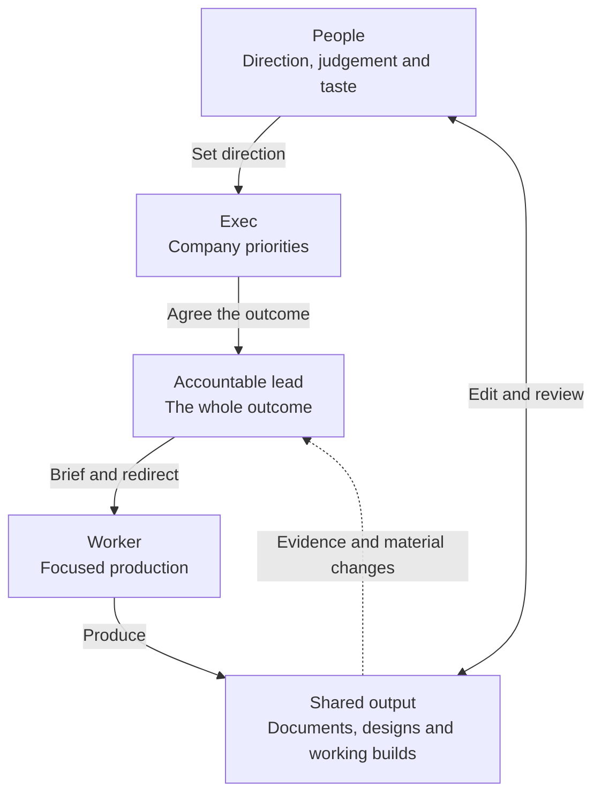
```mermaid
flowchart TB
    humans["People<br/>Direction, judgement and taste"]
    exec["Exec<br/>Company priorities"]
    lead["Accountable lead<br/>The whole outcome"]
    worker["Worker<br/>Focused production"]
    output["Shared output<br/>Documents, designs and working builds"]

    humans -->|Set direction| exec
    exec -->|Agree the outcome| lead
    lead -->|Brief and redirect| worker
    worker -->|Produce| output
    humans <-->|Edit and review| output
    output -.->|Evidence and material changes| lead
```

The design covers four kinds of work:

| Mode | What it means for the business |
| --- | --- |
| **Explore** | Investigate an uncertain market, compare approaches and decide which evidence would justify investment. |
| **Execute** | Carry an agreed outcome through production, review and delivery with a clear owner. |
| **Repair** | Respond to failed checks, broken tools, lost sessions or changed requirements while keeping useful work. |
| **Evolve** | Turn experience into better company knowledge, examples and reusable practices. |

Read the [OrgIntel specification](docs/specs/orgintel.md) and the
[capability evidence guide](docs/product-capabilities.md) for how it works.

## What's inside

Built like a company, not a chat window.

**Rooms for people and agents.** Talk one-to-one or in groups and choose which people and agents
take part. Everyone has their own account, permissions and tag.

**Shared documents.** Co-edit rich text live, comment on a passage, compare versions and carry
feedback into the next revision. Built on Tiptap, Yjs and Hocuspocus.

**Goals that survive restarts.** Switch models, restart a session or hand the work over. The goal,
the owner and what comes next stay put.

**A real company computer.** A persistent Linux machine with files, Git, a browser and a desktop
you can take over. Sessions end. Models change. The machine, its files and its history stay.

**Authority, enforced by code.** Decide what agents may do alone and what needs you. Budgets, a
vault and a record of every external action.

**A company that knows itself.** Approved facts, voice and visual language travel with the work.
Change a fact and Restless flags what used the old one.

**Quality is part of the brief.** Choose Fast, Thorough, Exceptional or Frontier for the company
or for one outcome. It sets how deep agents go. Permissions and spending limits are separate.

<details>
<summary><b>Every capability, in detail</b></summary>

### Work together

| Capability | What you can do |
| --- | --- |
| **Human multiplayer** | Bring cofounders and colleagues into the same workspace as your AI agents, with their own accounts and permissions. |
| **Collaborative documents** | Co-edit rich-text documents with live sync, named versions and exports. |
| **Comments and document review** | Comment on a passage or the whole document, resolve discussions and compare proposed edits with the original. |
| **Rooms and conversations** | Talk one-to-one or in groups, and choose which people and agents take part. |
| **Attention** | Open the decisions, outcome reviews and requests that need your judgement, with the relevant work and evidence attached. |
| **Executive conversation** | Steer the company through a persistent conversation beside the active workspace. |
| **Ready for your input** | Get the work prepared for the specific step only you can take, with a clear way for agents to continue afterwards. |
| **See what happened next** | Follow what your decision made possible, who picked up the work and whether it finished or got stuck. |

### Run ongoing company work

| Capability | What you can do |
| --- | --- |
| **Goals that survive restarts** | Keep the goal, who is responsible and the work history when an agent session ends or restarts. |
| **Different levels of responsibility** | Keep company priorities with Exec, the whole outcome with its lead, and focused production with workers. |
| **Work board and dependency map** | See who is doing what, which work is waiting on something else and what needs another pass. |
| **Supervision when it matters** | Bring a lead in when requirements change, checks fail or work gets stuck. Routine progress can pass without another model call. |
| **Schedules and follow-ups** | Set one-off or recurring weekday jobs, see when they ran and choose how to handle missed runs. |
| **The right context for each agent** | Give agents the goals, messages, decisions and sources they need, and save enough context to pick up later. |
| **Memory with sources** | Keep track of what was observed, what is an assumption and what was decided, including where information came from and how current it is. |
| **Reusable company know-how** | Keep instructions, skills, scripts and internal tools in the company workspace and version them with the work. |

### Set the standard and improve the result

| Capability | What you can do |
| --- | --- |
| **Outcome standards** | Choose Fast, Thorough, Exceptional or Frontier for the company or an individual outcome. |
| **Review the actual result** | Try the application, read the document, open the page or play the media you are reviewing. |
| **Know which version was checked** | Keep the reviewed version unchanged, with a record of the material it used and the checks run on it. |
| **Revisions and related work** | Carry feedback into the next version and flag other work that relied on material you changed. |
| **Independent review** | Give a separate reviewer the result and the information needed to check it. |
| **Company Identity** | Save approved company facts (Truth), writing style (Voice), design guidance (Visual language) and ways of working (Culture), with a history of changes. |
| **Keep company content up to date** | Flag outputs that use outdated company facts or guidelines, decide what to update and approve lessons from the work. |
| **Pick up interrupted work** | Keep files and work history, identify what went wrong and give the next session the information it needs to recover. |

### Give the company a real computer

| Capability | What you can do |
| --- | --- |
| **Persistent Linux workspace** | Use ordinary files, Git, toolchains, packages and applications in a company environment that survives agent sessions. |
| **Embedded desktop** | Enter the company computer, inspect the result and take control to participate directly. |
| **Persistent browser** | Research, inspect live pages and work through browser tools in the company environment. |
| **Internal tools and services** | Build scripts, dashboards, prototypes and local applications with the tools the business needs. |
| **Per-agent intelligence** | Inherit a company model or choose a connection and model for a particular agent. |
| **CLI and APIs** | Operate the company, inspect work and automate interactions from the terminal. |
| **Multiple companies** | Switch between distinct businesses with their own work, people and company environments. |

### Keep autonomy accountable

| Capability | What you can do |
| --- | --- |
| **Permissions and ongoing approvals** | Choose what agents may do on their own and what needs your approval. Code enforces these rules. |
| **Membership, roles and permissions** | Control who can enter the workspace, who is responsible for each job and who may act on connected services. |
| **Budgets and spending** | Set model spending limits and see which requests used the budget or were stopped by the limit. |
| **Vault, powered by Infisical** | Store credentials through an established secrets backend and keep secret references in company configuration. |
| **Records of external actions** | See what was authorised and what happened. If an action’s result is unclear, Restless requires it to be checked before retrying. |
| **Resources and Doctor** | See which tools and services are available, when they were last checked and what needs fixing. |
| **Company floor** | Explore colleagues and teams through an interactive spatial view of the same company. |

The [Company Identity run](docs/dogfood/company-identity/s35-run-report.md) exercises identity
across two businesses. [How these features work, with code and examples →](docs/product-capabilities.md)

</details>

## Bring your people. Bring any model.

Codex, Claude, any API provider or gateway. Each agent can use a different model: Theo researches
on Gemini, Marlow leads on Claude, Ines builds on Codex.

| Connection | Setup |
| --- | --- |
| **Codex** | Connect the native Codex harness using sign-in or an OpenAI API key. |
| **Claude** | Connect the native Claude harness using sign-in or an Anthropic API key. |
| **API providers** | OpenAI, Anthropic, Google Gemini, OpenRouter, Groq, Mistral, DeepSeek, xAI, Moonshot, Z.ai and other supported connections. |
| **Custom endpoints** | Any OpenAI-compatible gateway, with your endpoint, model IDs and credentials. |

API credentials can live in the Infisical vault, with only references kept in company settings.

## Get started

On a Linux machine with Docker, one command installs the newest signed release as a service
and opens it:

```sh
curl -fsSL https://restless.run/install | bash
```

It verifies the release's signature, brings its own PostgreSQL if the machine has none, starts
Restless at `http://127.0.0.1:7788` and opens it in your browser. On a server it prints the SSH
port forward that reaches it instead. `restless.run/install` redirects to
[`scripts/install-core.sh`](scripts/install-core.sh) on `main`; read it first if you prefer. Connect **Codex, Claude or an API provider** under
**Company → Intelligence**. Upgrades, backups and restores are in
[self-hosting](docs/self-hosting.md).

### From source

To work on Restless itself you need a **Linux host with Rust/Cargo, Node.js 24/npm, Docker
with Compose v2, curl, jq and OpenSSL**, Docker running, and about 30 GiB free for the source
build and company image.

```sh
git clone https://github.com/BlueprintLabIO/restless-core.git
cd restless-core && npm --prefix web ci
./scripts/restless-dev my_company --reconcile
```

The launcher builds the daemon and company image, installs its pinned model broker, and
provisions PostgreSQL and an Infisical vault for a new development profile. The first build takes
a while. Open the workspace address it prints.

To start a company already wired to an API model, export the model and a reference to its key
first:

```sh
export RESTLESS_DEV_MODEL=anthropic/claude-sonnet-4-6
export RESTLESS_DEV_CREDENTIAL_REFERENCE=env:ANTHROPIC_API_KEY
./scripts/restless-dev my_company --reconcile
```

Existing companies keep their saved configuration. In another terminal, check the setup:

```sh
./scripts/restless-dev doctor my_company
```

Ctrl-C stops the foreground host processes; company containers and volumes persist. See
[web development](web/README.md) and [build storage](docs/BUILD_STORAGE.md) for details.

**Next steps**

- [Your first useful outcome](docs/first-outcome.md): delegate a client proposal, review the
  shared document and ask for a revision.
- [Self-hosted accounts](services/identity/README.md): separate sign-ins, email invitations and
  removal of member access for teammates.
- [Self-hosting](docs/self-hosting.md): upgrades, backups and restores of the installed service.
- **Rather not run Docker?** [Restless Cloud](https://restless.run/cloud/) is the same office
  with nothing to install. It is in private beta; [join the waitlist](https://restless.run/cloud/#waitlist).

## Product tour

Real development UI with the Lantern Studio example. Screenshots and video share a
**1920 × 1080 (16:9)** frame. [Capture details and captions](docs/media/README.md).

### Write and revise together

The brief, working draft, comments and version history live in one document. Live sync keeps
collaborators on the same page.

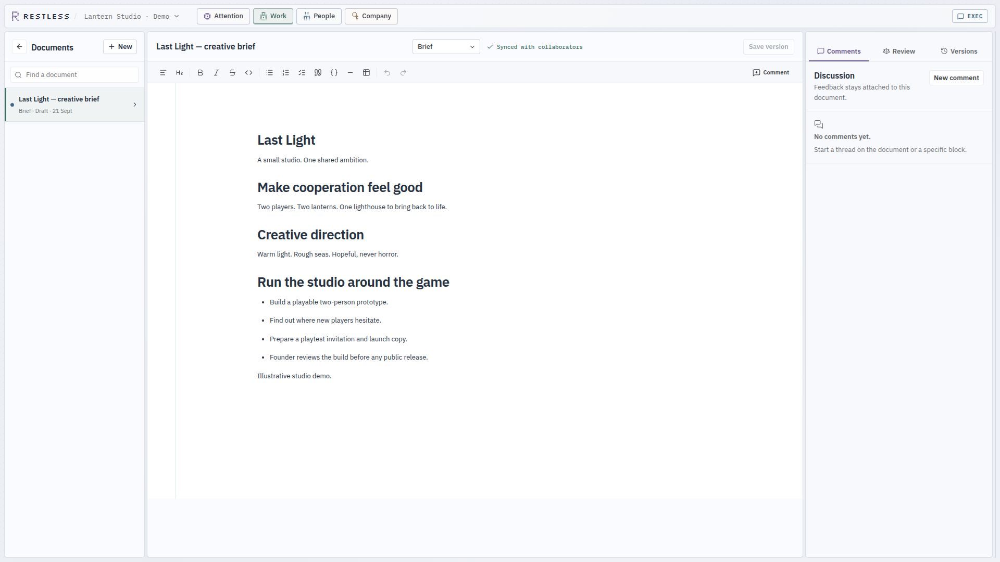

### Keep feedback attached to the result

Discuss a document or a passage, resolve comments and carry the requested changes into the next
version.

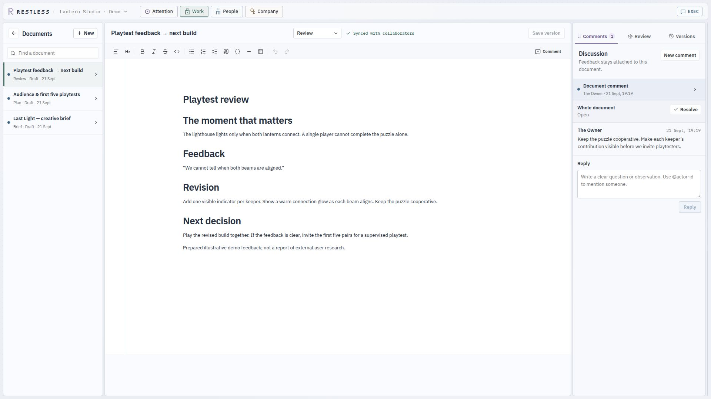

### Share a room with the people and agents involved

Direct and group rooms give each discussion an explicit audience. Direction, questions and
feedback stay together while documents and the company computer hold the work.

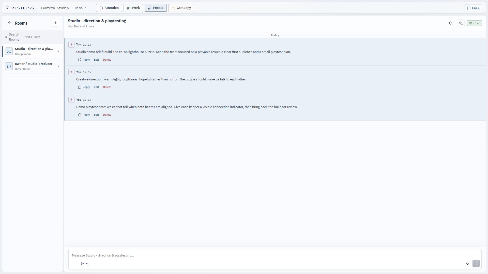

### Enter the company computer

Open the company's Linux desktop inside Restless, inspect the result and **Take control** when
you want to step in. Here, the studio's playable prototype is running.

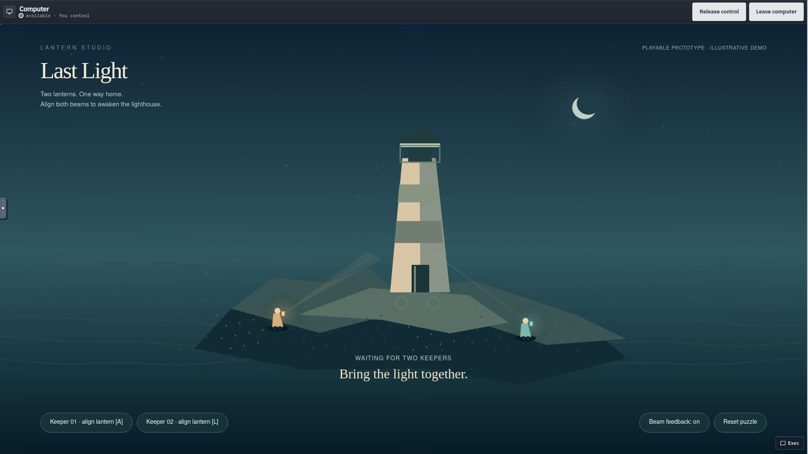

### Set authority and limits

Choose what the company may do on its own and which decisions need you. **Authority & limits**
brings autonomy, outcome standards, model spend ceilings and standing grants into one place.

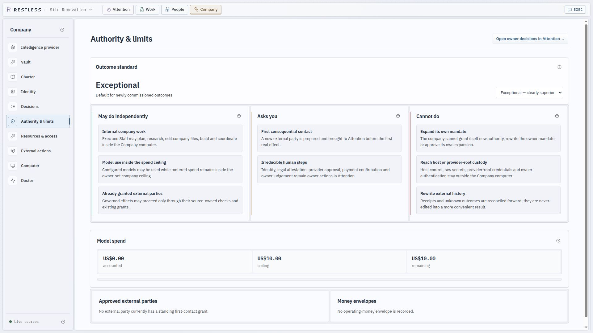

### See who owns what

People connects each role to its current work and accountable lead.

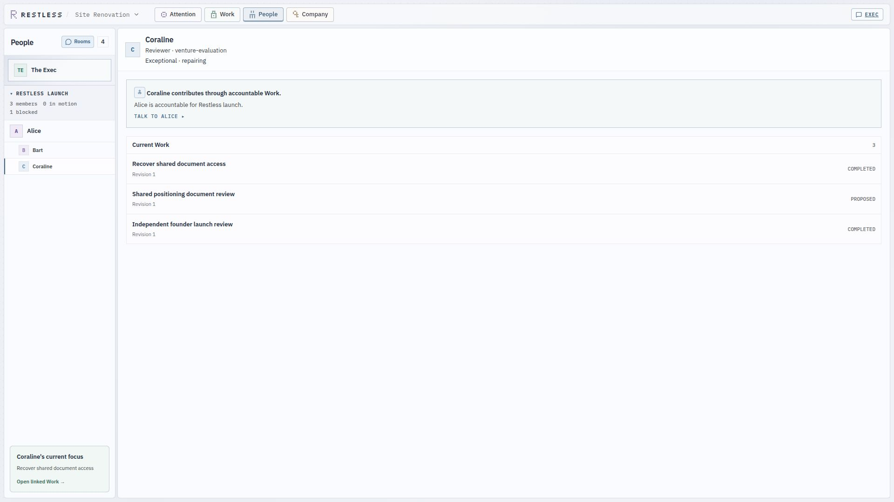

### Choose intelligence per agent

A researcher, lead and reviewer can use different models and connections.

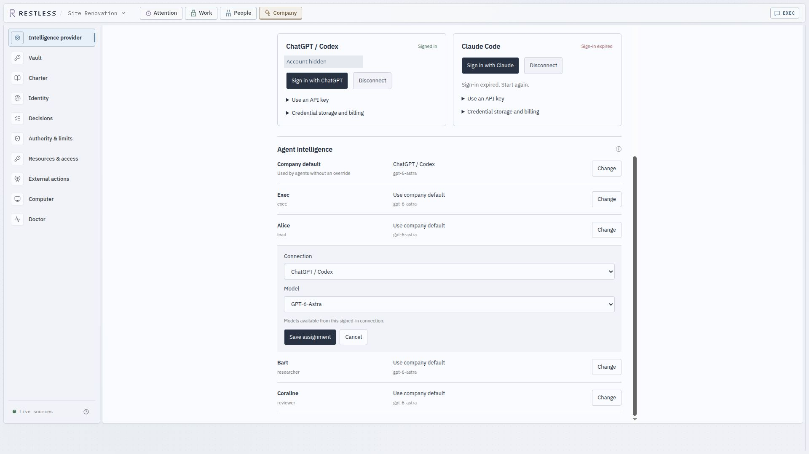

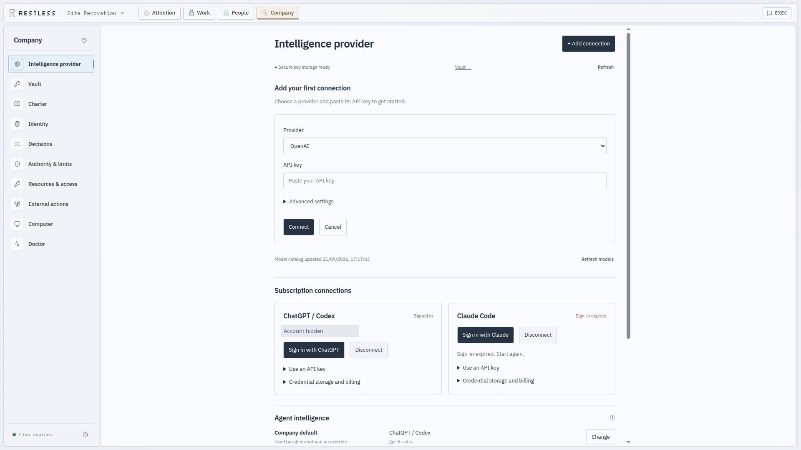

### Know what the company can use

**Resources & access** reports each capability with its observed state, source and time.
Doctor checks the execution path so you can find and fix a broken link.

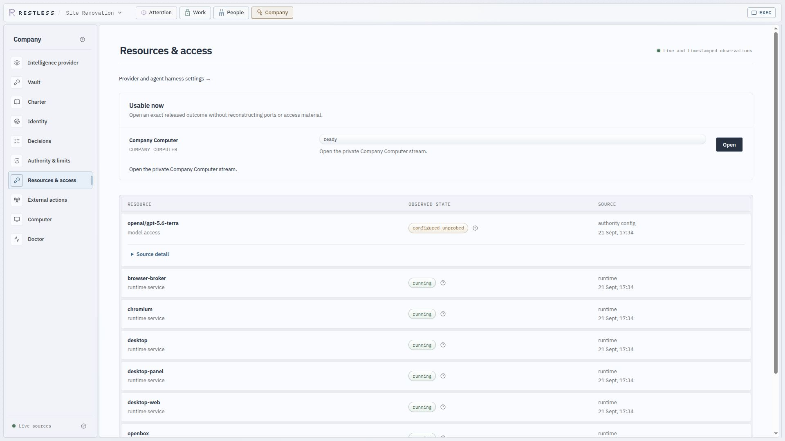

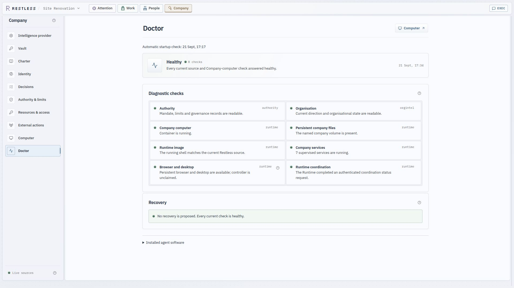

### Keep credentials in a real vault

Vault is based on [Infisical](https://github.com/Infisical/infisical). The owner can see the
credential inventory without displaying secret values; Restless controls how credentials reach
each provider or harness.

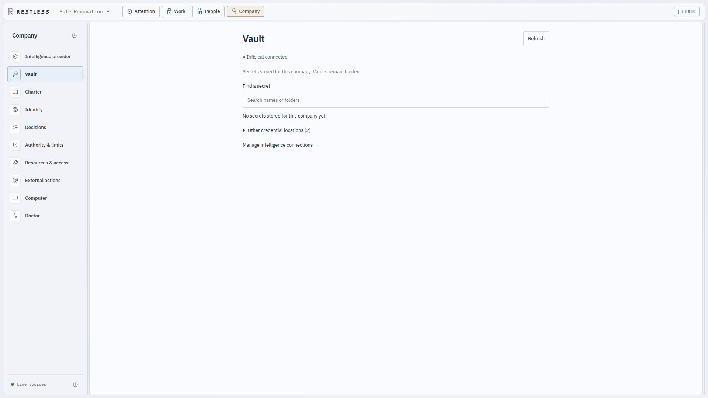

### Follow outcomes and revisions

The work board shows current state; the dependency map shows how outcomes relate.

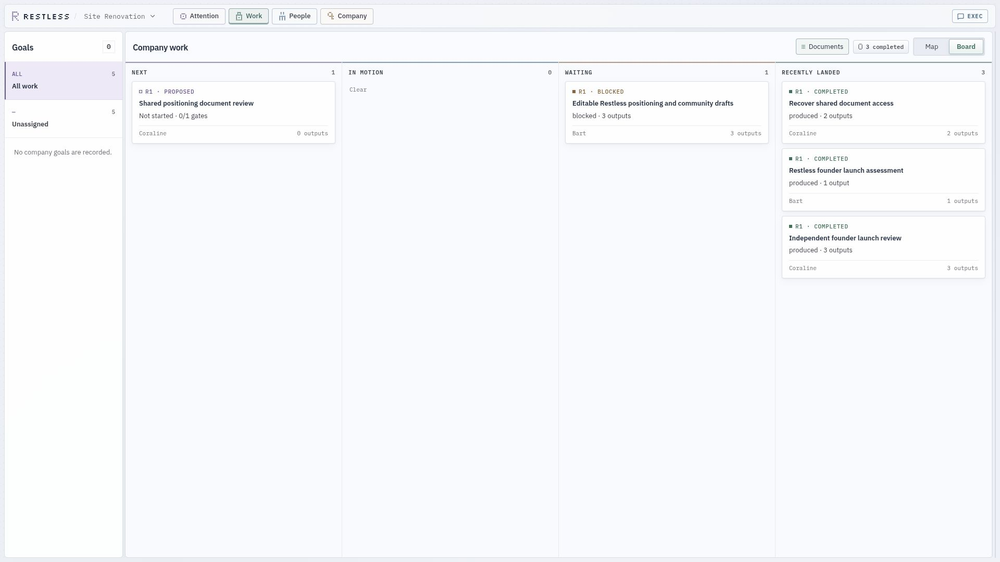

### See the company at a glance

The company floor is an interactive view of colleagues and teams, connected to the same work as
Attention, Work, People and Company.

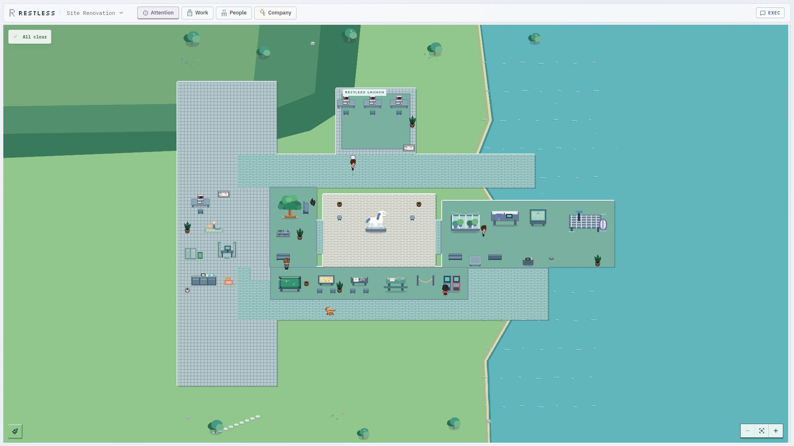

## Alternatives

### Why choose Restless over Paperclip?

**Choose Restless when you want to run the business alongside AI, with your team working
directly on the output.**

[Paperclip](https://github.com/paperclipai/paperclip) organises an agent company through roles,
goals, issues, budgets and agent runtimes. It is a strong fit if you want that agent-management
model. Its [issue workflow](https://docs.paperclip.ing/guides/day-to-day/issues/) lets a CEO
agent create and delegate work, with humans reviewing progress and approvals.

Restless starts from a different question: **what useful work can we finish together, and where
does human judgement improve it?**

- **Work on the result.** Your cofounder revises the brief, a colleague comments on the proposal,
  and you enter the company computer to try the build.
- **Spend attention on purpose.** The owner gets the output and a prepared decision; routine
  coordination stays with the accountable lead.
- **Keep the team as small as the work allows.** Start with one capable worker and add
  collaborators when they improve quality, check independently or save time.
- **Give agents the company's own facts, voice and taste,** and track which guidance each output
  used.
- **Make quality an operating choice.** Set an outcome standard, review the exact result and
  carry feedback into the next version.

Paperclip also offers [human membership](https://docs.paperclip.ing/guides/org/members-and-access/),
[ranked attention](https://docs.paperclip.ing/reference/api/attention/) and
[versioned issue documents](https://docs.paperclip.ing/guides/day-to-day/issues/). The choice is
the working relationship you want.

### When another tool is a better fit

| Alternative | Choose it for |
| --- | --- |
| [Paperclip](https://github.com/paperclipai/paperclip) | Managing an agent organisation through tasks, roles, budgets and bring-your-own runtimes. |
| [OpenClaw](https://github.com/openclaw/openclaw) | A general assistant across devices, messaging channels and extensible tools. |
| [Lindy](https://docs.lindy.ai/teammate/home) | A hosted business assistant connected to email, meetings and team tools. |
| [Manus](https://manus.im/desktop) | Delegating general tasks with computer-based execution. |
| [Relevance AI](https://relevanceai.com/workforce) | Configuring specialist agents and workflows into a workforce. |
| [n8n](https://github.com/n8n-io/n8n) | Explicit, repeatable automation with visual workflows and integrations. |
| [Dify](https://github.com/langgenius/dify) | Building AI applications, retrieval pipelines and agentic workflows. |
| [OpenHands](https://github.com/OpenHands/OpenHands) / [Gas Town](https://github.com/gastownhall/gastown) | Software engineering and coordinating coding agents. |
| [CrewAI](https://github.com/crewAIInc/crewAI) / [LangGraph](https://github.com/langchain-ai/langgraph) / [Microsoft Agent Framework](https://github.com/microsoft/agent-framework) | Building your own agent application and controlling its execution model. |

<details>
<summary><b>Features at a glance</b></summary>

**✓** Built in · **◐** Related feature, or possible with setup or integrations ·
**—** Not built in · **?** Not confirmed in the sources.
Features can vary by plan, connected tools or rollout. Sources checked **22 September 2026**.

#### Working together

| Feature | Restless | Paperclip | OpenClaw | Lindy | n8n | Dify |
| --- | :---: | :---: | :---: | :---: | :---: | :---: |
| Business work beyond coding | ✓ | ✓ | ✓ | ✓ | ✓ | ✓ |
| Shared workspace for human teammates | ✓ | ✓ | ◐ | ✓ | ✓ | ✓ |
| Multiple agents and delegation | ✓ | ✓ | ✓ | ✓ | ✓ | ✓ |
| Group chats with people and agents | ✓ | ◐ | ✓ | ✓ | ◐ | ◐ |
| Built-in document or file editing | ✓ | ✓ | ✓ | ✓ | ◐ | ◐ |
| Edit formatted documents together, live | ✓ | ◐ | ? | ◐ | ◐ | ◐ |
| Inbox for decisions and requests | ✓ | ✓ | ◐ | ✓ | ◐ | ◐ |
| View files or try interactive results | ✓ | ✓ | ✓ | ✓ | ◐ | ✓ |
| Built-in desktop you can control | ✓ | ◐ | ✓ | ? | ◐ | ◐ |
| CLI or API access | ✓ | ✓ | ✓ | ◐ | ✓ | ✓ |

#### Keeping work moving

| Feature | Restless | Paperclip | OpenClaw | Lindy | n8n | Dify |
| --- | :---: | :---: | :---: | :---: | :---: | :---: |
| Company goals and clear responsibilities | ✓ | ✓ | ◐ | ◐ | ◐ | ◐ |
| Agent profiles or conversation memory | ✓ | ✓ | ✓ | ✓ | ✓ | ✓ |
| Scheduled work and recurring routines | ✓ | ✓ | ✓ | ✓ | ✓ | ✓ |
| Reusable instructions, skills or playbooks | ✓ | ✓ | ✓ | ✓ | ◐ | ◐ |
| Recover or retry failed work | ✓ | ✓ | ✓ | ✓ | ✓ | ✓ |
| Bring Codex / Claude agent runtimes | ✓ | ✓ | ✓ | ? | ◐ | ◐ |
| Multiple model providers | ✓ | ✓ | ✓ | ◐ | ✓ | ✓ |
| Choose models for agents or workflow steps | ✓ | ✓ | ✓ | ◐ | ✓ | ✓ |
| General visual workflow editor | — | ? | ? | ✓ | ✓ | ✓ |
| Self-hostable core | ✓ | ✓ | ✓ | ? | ✓ | ✓ |

#### Quality, company identity and authority

| Feature | Restless | Paperclip | OpenClaw | Lindy | n8n | Dify |
| --- | :---: | :---: | :---: | :---: | :---: | :---: |
| Human approvals and permissions | ✓ | ✓ | ✓ | ✓ | ✓ | ✓ |
| Use review feedback in the next revision | ✓ | ✓ | ◐ | ◐ | ✓ | ✓ |
| See model usage or costs | ✓ | ✓ | ✓ | ✓ | ◐ | ✓ |
| Enforce model spending limits for companies or agents | ✓ | ✓ | ? | ◐ | ◐ | ◐ |
| Track the reviewed version, its sources and revisions | ✓ | ◐ | ? | ? | ◐ | ◐ |
| Set quality standards for the company or a piece of work | ✓ | ◐ | ◐ | ◐ | ◐ | ◐ |
| Track which approved company facts and guidelines each job uses | ✓ | ◐ | ◐ | ◐ | ◐ | ◐ |
| Flag outdated content when company facts or guidelines change | ✓ | ? | ? | ? | ? | ? |
| Store and manage API keys and credentials | ✓ | ✓ | ✓ | ✓ | ✓ | ✓ |
| Control access to connected tools | ✓ | ✓ | ✓ | ✓ | ✓ | ✓ |

An alternative's ◐ credits related prompts, skills, knowledge or workflows. n8n, Dify and Lindy
provide visual workflow building; Restless's work graph describes outcomes and revisions, and
reusable automation lives in company tools and scripts. The
[comparison notes and sources](docs/product-capabilities.md#comparison-notes-and-sources) explain
each row. Corrections are welcome through an issue or PR.

</details>

## Architecture

Restless separates three responsibilities:

| Layer | Responsibility |
| --- | --- |
| **Constitutional Kernel** | Authority, credentials, budgets, external effects and recovery. |
| **Organisational Intelligence (OrgIntel)** | Goals, accountable work, actors, context, review, company identity and coordination. |
| **Company Linux Runtime** | The persistent computer where agents use tools, edit files and produce results. |

The kernel bounds consequential actions. OrgIntel coordinates the work. The runtime provides the
environment to do it.

### Built on established tools

| Foundation | Role in Restless |
| --- | --- |
| [Infisical](https://github.com/Infisical/infisical) | Vault storage and machine identity, behind Restless's credential adapter. |
| [Tiptap](https://github.com/ueberdosis/tiptap), [Yjs](https://github.com/yjs/yjs), [Hocuspocus](https://github.com/ueberdosis/hocuspocus) | Rich-text editing, shared document state and collaboration transport. |
| [PostgreSQL](https://www.postgresql.org/) | Durable company, work and collaboration state. |
| Linux and Docker / OCI | Persistent company execution environments, files, processes and applications. |
| Rust | Daemon, CLI, coordination and model gateway. |
| SvelteKit | The human workspace: Attention, Work, People and Company. |
| Codex and Claude | Native agent harnesses, alongside Restless-managed API execution. |
| [Pixel Agents](https://github.com/pixel-agents-hq/pixel-agents) | The company floor, with character art based on JIK-A-4's MetroCity pack. |

Read [ARCHITECTURE.md](ARCHITECTURE.md) and [coordination theory](docs/COORDINATION_THEORY.md)
for the responsibility boundaries and team design.

## Contributing

Start with the [working agreement](CLAUDE.md), [architecture](ARCHITECTURE.md), and the
relevant [sprint](docs/sprints/README.md). The most useful contributions close a real workflow
gap and show the resulting output or behaviour.

| Path | Contents |
| --- | --- |
| `crates/restlessd/` | Daemon binary: starts the engine and the owner API |
| `crates/restless-engine/` | Everything beneath the owner API, including the coordination socket |
| `crates/restless-owner/` | Owner HTTP and WebSocket API |
| `crates/restless-contracts/` | Released contracts shared with the CLI |
| `crates/restless/` | Operator CLI |
| `crates/restless-orgintel/` | Recoverable company and work state |
| `crates/restless-model-gateway/` | Model routing and spend accounting |
| `infra/company-image/` | Persistent company computer |
| `services/native-documents-collaboration/` | Document collaboration service |
| `web/` | Owner workspace |
| `web/src/lib/ui/` | The design system: tokens, pixel marks, pure views. Packed as `@restless/ui` (`npm run pack:ui`); `/gallery` renders all of it from fixtures |
| `web/src/lib/office/` | The company floor. Packed with its engine and sprites as `@restless/office` (`npm run pack:office`) for restless.run |
| `experiment/` | Experiment designs and recorded results |

The hosted service and the public website live in a separate private repository. This
repository contains the local company core, architecture and experiment evidence.

## License

Restless Core is licensed under [Apache 2.0](LICENSE). The Restless name, marks, visual
identity, hosted service and private cloud control plane are not licensed by this repository.
