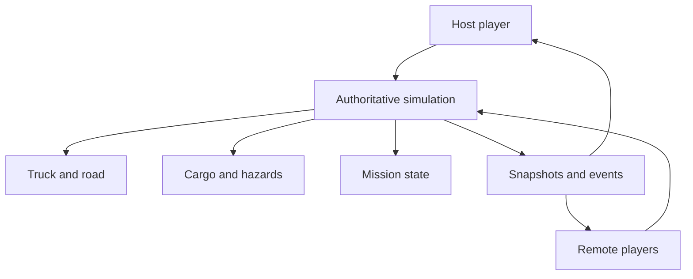

# Swift Arrival — Multiplayer Architecture

Status: proposed MVP architecture

Player count: 1–6

Network model: host-authoritative listen server

## Decision

Write gameplay networking against **Godot’s high-level `MultiplayerAPI`**, using RPCs and scene replication where appropriate. Keep the transport behind a small session adapter:

| Environment | Transport | Purpose |
| --- | --- | --- |
| Local development and LAN | `ENetMultiplayerPeer` | Fastest path to a working multiplayer vertical slice |
| Steam native release | Steam Networking Sockets through a maintained Godot `MultiplayerPeer` integration | Lobbies, invites, NAT traversal and relay |
| Browser | `WebRTCMultiplayerPeer` | Low-latency peer-to-peer browser sessions |

Do not maintain separate gameplay networking implementations. Once a peer is assigned to `multiplayer.multiplayer_peer`, game code should use the same RPC and authority paths regardless of transport.

Steam and browser cross-play is not part of the MVP. Supporting it cleanly would likely require a common dedicated service rather than two different peer-to-peer transports.

## Topology



One player runs both a client and the authoritative server. There is no dedicated server initially.

If the host leaves, the MVP ends the session and preserves the latest completed delivery checkpoint. Host migration is expensive and low priority for a friends-only game.

## Why authority matters

The host owns every gameplay fact that can cause disagreement:

| State | Authority | Client behaviour |
| --- | --- | --- |
| Truck movement and collisions | Host | Driver sends input; clients interpolate truck state |
| Cargo rigid bodies | Host | Clients render interpolated snapshots |
| Player movement | Host, with local prediction | Owner predicts; host validates and corrects |
| Hand targets and grip requests | Host | Owner predicts visual hand motion; host solves constraints |
| Arm pose | Derived | Clients reconstruct limbs from shoulders and replicated hand targets |
| Grab/drop/throw | Host | Client requests action and may animate immediately |
| Damage, leaks, explosions | Host | Clients receive reliable events |
| NPC perception, decisions and actions | Host | Clients interpolate movement and render replicated intent/state |
| Mission progress and money | Host | Read-only replication |
| Cosmetic animation and camera | Each client | Never sent unless another player must see it |

Do not let clients send authoritative transforms, cargo damage or money changes. They send intent: movement input, grab request, button press or steering input.

## First-person physics arms

The camera and locomotion capsule remain stable while two world-space hands follow spring-driven targets. The host simulates grip constraints and object reactions; clients predict only local hand presentation.

Replicate:

- Left and right target position and orientation.
- Grip pressed/released state.
- Requested object or interaction socket.
- Grip strength or interaction mode when relevant.
- Brief tumble/recovery state.

Do not replicate every arm bone. Each client reconstructs elbows and shoulders with IK from the player body and hand targets. Locally smooth the visual arms without changing the authoritative grip point.

Heavy objects, truck acceleration and other players can pull hands away from their targets. The host releases a grip only after a telegraphed force threshold or an explicit player action. Driving uses the same system with stable interaction sockets on the wheel, gear lever and handbrake.

## The two-frame truck simulation

A normal rigid-body truck containing several networked rigid bodies is prone to jitter and disagreement. Use two related coordinate frames:

1. **Exterior frame** — the host simulates the truck on the road using a simplified vehicle body.
2. **Interior frame** — players and cargo are represented relative to the truck, with pseudo-forces derived from acceleration, braking, turning and impacts.

Rendering composes each interior object’s local transform with the truck’s global transform. When something exits through a door or window, the host converts it from truck-local state into exterior world state.

This preserves the sensation of a moving vehicle, keeps rear players and cargo stable, and still lets everyone see the real world through the truck’s windows.

## Exterior climbing on a moving truck

Use assisted climbing rather than a fully physical character suspended from raw joints. The local player raycasts from each hand toward authored sockets or grip points generated over tagged climbable surfaces. The host validates the grip, owns attachment state and simulates the character relative to the truck frame while contact is maintained.

- Clients predict hand placement and visual arm motion immediately.
- The stable locomotion capsule follows constrained climbing movement while limbs use spring-driven IK.
- Handholds tolerate small network and collision errors before breaking.
- Grip loss is based on telegraphed force thresholds, not one bad physics frame.
- On release, the host converts truck-local position and velocity into exterior world state.
- Ledge catches, coyote time and recovery handles prevent minor errors becoming long resets.

This keeps input reliable and networking tractable while acceleration, body lean, wind and floppy limbs make climbing look dangerous.

## Interchangeable trucks

Gameplay must not assume one concrete truck scene. Each vehicle implements a shared `TruckSpec` describing:

- Seats and driving controls.
- Interior cargo volume and local reference frame.
- Doors, windows, hatches and exit transforms.
- Strap anchors and interaction sockets.
- Exterior collision body and driving parameters.
- Roof, hitch and attachment points.

During a transfer, the host preserves player, cargo, mission and damage state; despawns the previous vehicle only after cargo has physically moved or the scenario explicitly abandons it. Build only one truck for the vertical slice, then use a second deliberately different vehicle to validate the abstraction.

## Update strategy

Starting values, to be tuned through playtesting:

| Data | Delivery | Starting rate |
| --- | --- | --- |
| Player and driver input | Unreliable ordered | 30 Hz |
| Hand targets | Unreliable ordered | 20–30 Hz |
| Truck snapshot | Unreliable ordered | 20 Hz |
| Player snapshot | Unreliable ordered | 20 Hz |
| Active cargo snapshots | Unreliable ordered | 10–15 Hz |
| Grab, drop, hatch and impact events | Reliable | Event-driven |
| Mission, inventory and money | Reliable | On change |
| Cosmetic animation parameters | Unreliable | 10 Hz or derived locally |

Render remote objects 100–150 ms behind the newest received state and interpolate between buffered snapshots. Extrapolate only briefly. Teleport or hard-correct objects after large errors.

Prioritise cargo near players and cargo currently moving. Sleeping crates do not need continuous snapshots.

## Godot responsibilities

Use:

- `MultiplayerAPI` for peer lifecycle, IDs and RPC routing.
- `@rpc` methods for player intent, validated interactions and discrete events.
- `MultiplayerSpawner` for players, cargo and enemies created during a session.
- `MultiplayerSynchronizer` for simple low-frequency properties where it remains clear and efficient.
- Custom packed snapshots for the truck and many active rigid bodies.

Avoid blindly synchronising the transforms of every physics object with `MultiplayerSynchronizer`. Physics snapshots need explicit rate control, prioritisation, interpolation and sleep handling.

## NPC simulation

Run all consequential NPC logic on the host. NPC intelligence is a small layered system:

1. **Perception** records visible players, cargo, sounds, hazards and recent sightings.
2. **Utility scoring** periodically ranks goals such as flee, steal, attack, help or escape.
3. **State machines** execute the chosen goal through steps such as approach, open, grab, carry and leave.
4. **Shared interactions** make NPCs use the same doors, grips, cargo and physical hazards as players.

Stagger utility evaluations across frames at roughly 2–5 decisions per second per NPC. Replicate current intent, coarse state and authoritative movement rather than the entire decision process. Keep navigation, perception, utility curves and personality definitions data-driven. Do not introduce LLM inference, full GOAP planning or a large behaviour-tree framework for the vertical slice.

## Background world-event simulation

A host-owned world-event director selects a seeded event, location and escalation level before or during a route. Events use three simulation budgets:

| Level | Simulation and replication |
| --- | --- |
| Spectacle | Clients render a shared seed, timing and major animation state; no authoritative collisions |
| Collateral | Host owns spawned debris, traffic responses, blocked roads and other route effects |
| Convergence | Host runs the event as a normal mission encounter with authoritative NPCs, hazards and objectives |

Keep distant battles deliberately simplified: a few authored animation phases, audio cues, particles and low-detail actors can imply a conflict larger than the actual simulation. Clients may generate purely cosmetic particles locally, but anything capable of moving the truck, cargo, players or mission state remains host-authoritative.

The intensity director prevents unrelated world events from breaking protected recovery periods. A spectacle can remain visible during calm driving, but it should not escalate into collateral until the pacing budget permits it.

## Causal action ledger and acknowledgement

The authoritative host records compact, story-worthy causal events rather than attempting to retain every physics contact:

```text
Actor + Action + Target + Method + Result + Witnesses + Context
```

Examples include a player killing a hatched dinosaur with a cargo ramp, a robber opening a poison container, or a customer witnessing the crew disguise illegal cargo. Each event references stable entity and player IDs plus typed tags such as `hatched`, `imprinted`, `killed`, `impact`, `frozen`, `witnessed` and `concealed`.

The ledger drives immediate reactions, mission state, drop-off inspection and persistent follow-ups. Generic cargo uses composable reaction templates; hero cargo and recurring characters can override them with authored responses. No LLM generation is required.

Only the host appends consequential events. Clients receive relevant acknowledgement events and the final delivery summary. Apply coalescing and caps so repeated minor impacts become one meaningful fact such as `severely dented by repeated collisions` rather than hundreds of records.

## Session adapter

Keep platform setup out of gameplay code:

```text
network/
  session_manager.gd
  transport.gd
  enet_transport.gd
  steam_transport.gd
  webrtc_transport.gd
  snapshot_codec.gd
  interpolation_buffer.gd
  authority.gd
```

The transport interface only needs operations such as:

```gdscript
class_name NetworkTransport
extends RefCounted

func host_session(max_players: int) -> MultiplayerPeer:
    return null

func join_session(join_data: Dictionary) -> MultiplayerPeer:
    return null

func shutdown() -> void:
    pass
```

An early ENet implementation is deliberately small:

```gdscript
class_name EnetTransport
extends NetworkTransport

const PORT := 7000

func host_session(max_players: int) -> MultiplayerPeer:
    var peer := ENetMultiplayerPeer.new()
    var error := peer.create_server(PORT, max_players)
    if error != OK:
        push_error("Could not host ENet session: %s" % error_string(error))
        return null
    return peer

func join_session(join_data: Dictionary) -> MultiplayerPeer:
    var peer := ENetMultiplayerPeer.new()
    var address: String = join_data.get("address", "127.0.0.1")
    var error := peer.create_client(address, PORT)
    if error != OK:
        push_error("Could not join ENet session: %s" % error_string(error))
        return null
    return peer
```

The session manager assigns the resulting peer:

```gdscript
func host(transport: NetworkTransport) -> void:
    var peer := transport.host_session(6)
    if peer != null:
        multiplayer.multiplayer_peer = peer

func join(transport: NetworkTransport, join_data: Dictionary) -> void:
    var peer := transport.join_session(join_data)
    if peer != null:
        multiplayer.multiplayer_peer = peer
```

Gameplay code then remains transport-independent.

## Intent and snapshot pattern

Remote players send input to peer `1`, which is the conventional server ID in Godot’s high-level multiplayer API:

```gdscript
func send_local_input(tick: int, input: Dictionary) -> void:
    if multiplayer.is_server():
        _queue_validated_input(multiplayer.get_unique_id(), tick, input)
    else:
        submit_input.rpc_id(1, tick, input)

@rpc("any_peer", "call_remote", "unreliable_ordered", 0)
func submit_input(tick: int, input: Dictionary) -> void:
    if not multiplayer.is_server():
        return
    var sender := multiplayer.get_remote_sender_id()
    _queue_validated_input(sender, tick, input)
```

The host periodically publishes compact snapshots:

```gdscript
@rpc("authority", "call_remote", "unreliable_ordered", 1)
func receive_snapshot(server_tick: int, payload: PackedByteArray) -> void:
    interpolation_buffer.push_snapshot(server_tick, payload)
```

Discrete requests are reliable and validated by the host:

```gdscript
@rpc("any_peer", "call_remote", "reliable", 2)
func request_grab(cargo_id: int) -> void:
    if not multiplayer.is_server():
        return

    var sender := multiplayer.get_remote_sender_id()
    if authority.can_grab(sender, cargo_id):
        cargo_system.grab(sender, cargo_id)
        confirm_grab.rpc(sender, cargo_id)

@rpc("authority", "call_local", "reliable", 2)
func confirm_grab(player_id: int, cargo_id: int) -> void:
    cargo_view.attach_to_player(player_id, cargo_id)
```

Prototype with dictionaries for clarity. Replace high-frequency messages with a versioned `PackedByteArray` codec only after profiling shows the need.

## Steam path

1. Finish gameplay networking with ENet first.
2. Add Steam initialization, identity, lobbies and invitations.
3. Integrate a currently maintained GodotSteam `MultiplayerPeer` build backed by Steam Networking Sockets.
4. Replace only the transport/session setup, leaving RPC gameplay unchanged.
5. Pin the exact plugin, Godot and Steamworks SDK versions in the repository.

GodotSteam has recently moved its active repositories from GitHub to Codeberg. Re-evaluate and pin the current maintained release at integration time rather than copying an old tutorial or binary now.

## Browser path

1. Run a small HTTPS TypeScript WebSocket service for room codes and WebRTC signalling.
2. Use a public STUN service for discovery and a TURN relay for connections that cannot establish direct peer-to-peer communication.
3. Create a `WebRTCMultiplayerPeer` and assign it to Godot’s `MultiplayerAPI`.
4. Use the same gameplay RPCs as the native build.

Browsers cannot use Godot’s normal raw UDP transport. They support WebRTC and WebSockets, and tab suspension may disconnect a running game. Browser support should therefore follow the Steam vertical slice rather than dictate the first implementation.

## Validation and abuse resistance

Even in a friendly co-op game, the host should reject malformed or impossible requests:

- Clamp steering, movement and look inputs.
- Rate-limit RPC calls.
- Check player distance and line of sight before grabbing cargo.
- Confirm that requested cargo and controls exist.
- Validate ownership before dropping or throwing.
- Never deserialize arbitrary object types from peers.
- Cap packet sizes and list lengths.
- Treat player names and chat text as untrusted display content.

## Testing strategy

- Start multiple headless/local instances from one command.
- Run scripted connect, disconnect and reconnect cases.
- Inject latency, jitter, loss and reordered packets.
- Test a remote driver while the host works in the cargo area.
- Test both hands holding one object while another player grabs it.
- Test grip behaviour during braking, impacts and temporary packet loss.
- Fill the truck with the maximum expected active cargo.
- Verify that a sleeping cargo object consumes no recurring bandwidth.
- Verify conversion between interior and exterior coordinates through every door and window.
- Test climbing and grip recovery during acceleration, corners and packet loss.
- Verify NPCs cannot make authoritative decisions on clients or grab already-owned cargo illegally.
- Verify spectacle-only world events cannot affect authoritative physics or mission state.
- Confirm every collateral event is reproducible from the recorded event seed and phase.
- Confirm causal records identify the responsible actor, method, result and relevant witnesses.
- Test delivery evaluation against unusual states such as dead, hatched, substituted, stolen, cooked or delivered with an enemy attached.
- Record deterministic server snapshots when diagnosing desync.

## Implementation order

1. Two ENet players in an empty scene.
2. Spawn/despawn and reconnect handling.
3. Player input, server movement and interpolation.
4. First-person hand targets, IK reconstruction and one grip constraint.
5. Simplified truck movement.
6. Truck-local interior frame.
7. One networked crate with two-hand and multi-player grabbing.
8. Assisted truck-exterior climbing with one roof handhold route.
9. Common `TruckSpec` validated by one temporary second vehicle.
10. One robber using perception, utility selection and physical grabbing.
11. Multiple cargo objects with snapshot prioritisation.
12. Full six-player stress test.
13. Steam lobby and transport adapter.
14. Browser/WebRTC experiment.

## Explicit MVP non-goals

- Dedicated authoritative servers.
- Competitive anti-cheat.
- Host migration during a mission.
- Steam/browser cross-play.
- Full rollback of all rigid bodies.
- Networking hundreds of awake physics objects.
- Persisting an exact mid-collision physics state.

## Reference links

- [Godot high-level multiplayer](https://docs.godotengine.org/en/stable/tutorials/networking/high_level_multiplayer.html)
- [Godot WebRTC](https://docs.godotengine.org/en/stable/tutorials/networking/webrtc.html)
- [Godot multiplayer channels](https://docs.godotengine.org/en/stable/classes/class_multiplayerpeer.html)
- [GodotSteam project](https://godotsteam.com/)
