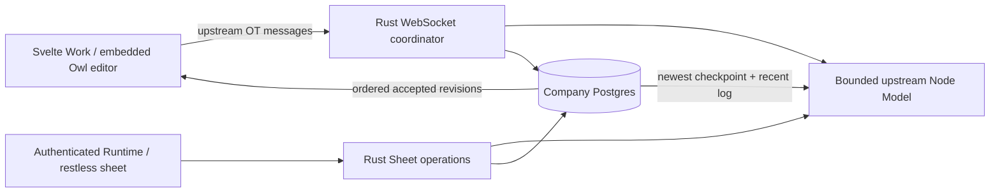

# Native Sheets

Sheets live beside Docs in company Work. A workbook is upstream o-spreadsheet
JSON, with company-local metadata, explicit participants and durable revision
history in the cell's Postgres database. There is one body writer: accepted
upstream commands. Agents never maintain a parallel business table.

Browser and headless engine pin o-spreadsheet 19.0.51 and Owl 2.8.2. The Rust
coordinator locks the workbook row, compares `serverRevisionId` with its current
head, and atomically persists accepted revisions plus attribution. Upstream
clients receive that ordered stream, transform pending commands when another
revision wins, and resend against the new head. Undo/redo uses the same stream;
the server rejects an Actor undoing another Actor's revision. Browser snapshots
cannot replace durable truth. Fresh Models receive server-owned client IDs;
secret reconnect tokens resume a Model and replace its live generation so two
Models cannot mistake each other's edits for acknowledgements.

Company-visible sheets are readable by active company humans. Only the creator
and explicit edit participants can write. Private sheets require participation.
Agents require explicit grants. External suspended members and retired Actors
lose body and history access. Runtime authentication pins the Actor before tool
dispatch; the HTTP/WS surface uses the existing verified company principal and
session lease. The UI destroys its workbook and clears titles on a principal
partition change or confirmed access denial.

`restless sheet -c COMPANY --help` exposes create/list/read/edit/share/history
operations. Reads accept `get_range`, `filter`, `export_csv`, and `snapshot`.
Edits accept `set_cells`, `insert_rows`, `sort`, `create_worksheet`, `import_csv`,
and `update_record`. An edit requires the observed revision and an idempotency
UUID; its entire generated revision batch and receipt commit in one transaction.
Identical retries return the original receipt even after subsequent edits.
`update_record` locates an immutable `record_id` within a header range in the
current upstream model, allowing business edits to survive prior row sorting.
All positional mutations reject stale observed revisions.

The editor supplies upstream formulas, selection, copy/paste, widths and grid
formatting. Native CSV import begins at A1 of the active worksheet; export uses
its full populated range. Agent filters return a bounded filtered range without
changing other participants' view. Named and periodic (every 50 revisions)
checkpoints can be downloaded under the current sheet ACL. Recovery creates a
private new workbook from an immutable checkpoint; it cannot erase live pending
edits. Checkpoints retain their exact original receipt and reject key reuse for
different inputs.

The accepted log is kept whole, but a fresh read starts from the newest
server-computed checkpoint (taken every 50 revisions) that leaves at least 200
revisions to replay. Opening a sheet and validating an edit therefore replay a
bounded tail, not the whole history; a sheet with 13,019 revisions took over a
minute to open before this. Accepted risk: undoing a revision older than that
window is refused and the editor says so, because its inverse is no
longer replayed. Limits are 8 MiB workbook JSON,
30 worksheets, 1,000 columns, 100,000 rows and 5 million rectangular cells.
Range reads/writes/CSV exports are bounded to 10,000 cells. The serialized model
worker has no credentials, a 512 MiB Node heap cap, bounded input/output and a
60-second deadline. Its failure restarts
only the worker. A measured 5,000-cell resale workbook replays in about 2.4 seconds
on the development host; this is a workload check, not a latency guarantee.

Local promotion installs the pinned package and a copied Node runtime in an
immutable dependency directory, recording `RESTLESS_SHEETS_WORKER` and
`RESTLESS_NODE_BIN` in release.env. Hosted planes include the same service files
and production npm dependencies. Company cell export/restore naturally carries
the workbook tables with its Postgres dump; cross-release schema identity is 73.
Upstream LGPL notices and relinking/source instructions live in
`services/native-sheets/NOTICE`, and browser license text is served at
`/licenses/o-spreadsheet.txt`.

The surface keeps workbook content prominent, compact controls and fine borders.
The final visual comparison uses Beautiful UI's calm record-table density,
Cult UI's restrained inset surfaces, and Origin UI Svelte's ordinary form/focus
controls. No code or additional design runtime is imported from these references.

Critical checks are `npm --prefix services/native-sheets test`, the disposable DB
test `native_sheets_durable_agent_browser_acl_and_history`, and the opt-in real
WS test `services/native-sheets/test/live-smoke.mjs` with an explicit owner URL
and `*_test` company. The latter races two real upstream Models through Rust
and Postgres, verifies structural rebasing, headless/human convergence,
disconnected catch-up, duplicate receipts, full-range CSV and fresh replay.
