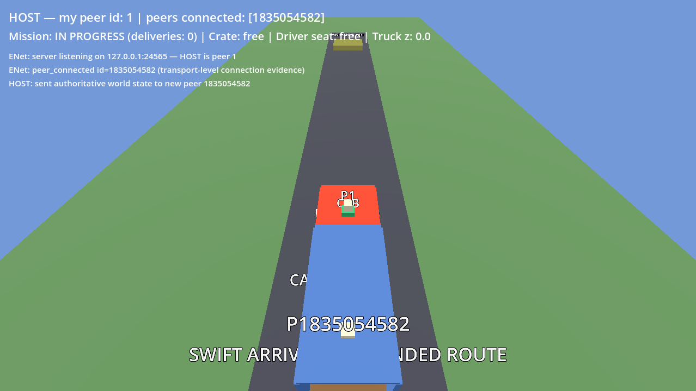
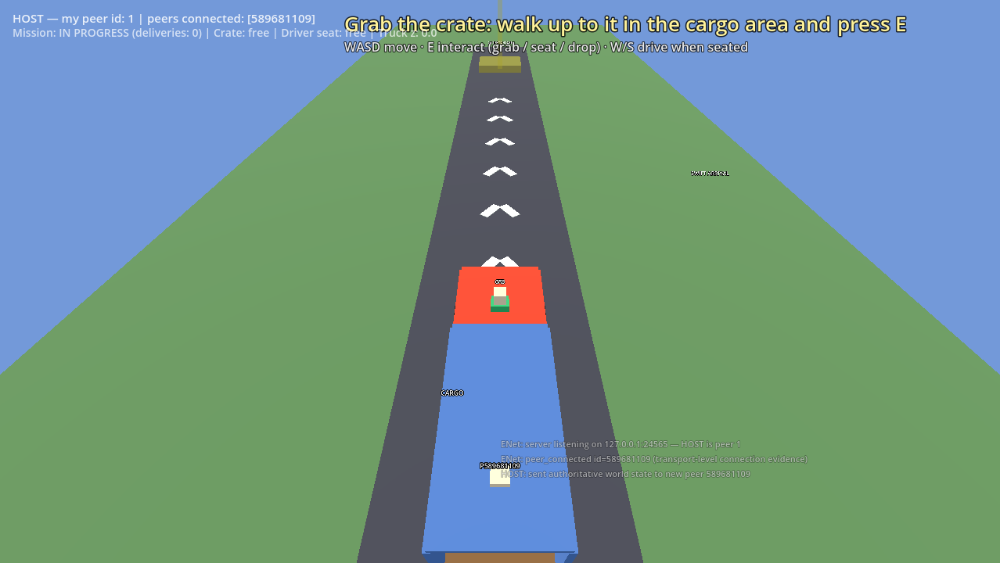
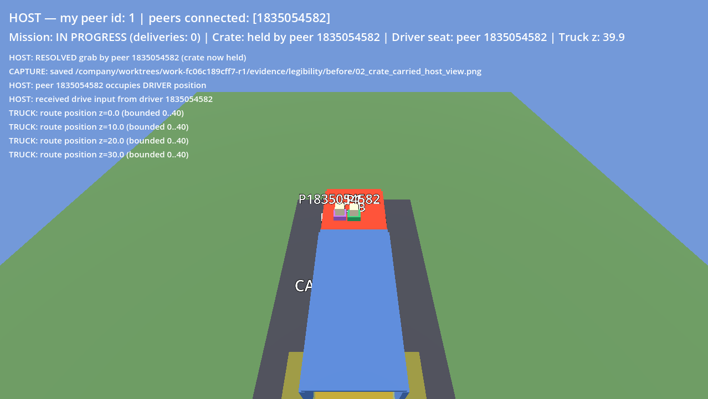
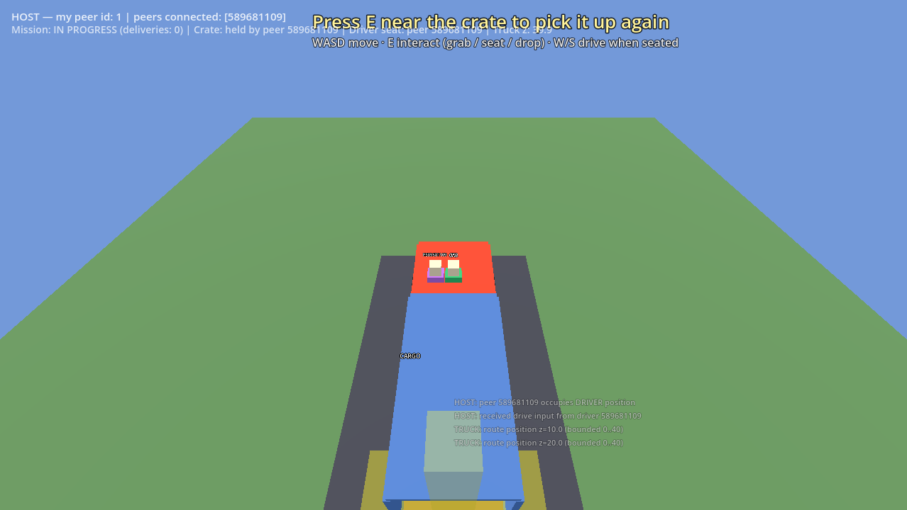

# Swift Arrival EXP-10 founder review

**Exact candidate:** `exp10_swift_continuous_r1_test:/company/repos/swift-arrival` at
`f9f5e61ed733d8479cf2ae3078779c73db457317`  
**Technical state:** clean; GDScript validation, positive host/client delivery and outside-zone
negative release probes all pass  
**Judgement sought:** Is the first-time delivery loop now legible enough to justify another product
cycle? This is a taste and investment decision, not another technical acceptance gate.

## Host and client connected

Before:

After:

## Route end

Before:

After:

The visible change is intentionally narrow: debug telemetry is quieter; overlapping world labels are
smaller; the current objective is explicit; chevrons and a destination beacon orient the player. The
placeholder world remains visually crude. A founder `continue` should mean the clearer loop is worth
another bounded improvement, not that this presentation is remotely release-ready.
